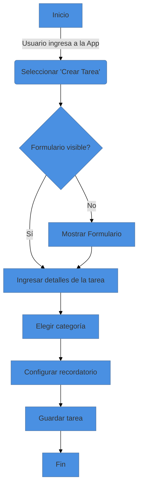

Útiles para representar procesos o flujos de trabajo. Muestran cómo se mueve la información o las tareas a través de varios pasos.

Diagrama de Flujo para el proceso de creación de una tarea en la aplicación "TaskMaster". Este diagrama muestra los pasos secuenciales desde que el usuario decide crear una tarea hasta que la tarea se guarda:

1. **Inicio**: El proceso comienza cuando el usuario ingresa a la aplicación.
2. **Seleccionar 'Crear Tarea'**: El usuario elige la opción para crear una nueva tarea.
3. **¿Formulario visible?**: Se verifica si el formulario para crear la tarea está visible.
    - Si **Sí**, el usuario procede a ingresar los detalles de la tarea.
    - Si **No**, el sistema muestra el formulario.
4. **Ingresar detalles de la tarea**: El usuario introduce la información requerida de la tarea.
5. **Elegir categoría**: El usuario selecciona una categoría para la tarea (por ejemplo, trabajo, personal, estudio).
6. **Configurar recordatorio**: Se configura un recordatorio para la tarea, si es necesario.
7. **Guardar tarea**: El usuario guarda la tarea.
8. **Fin**: El proceso de creación de la tarea concluye.

Este diagrama **MERMAID** (https://mermaid.live) lo muestra visualmente. Para copiar el código haz click en el botón "Edit this block" del siguiente dibujo/bloque:

