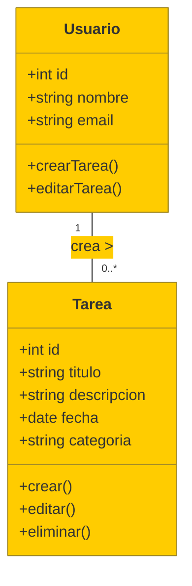

Ideales para modelar la estructura de un sistema de software mostrando clases, atributos, operaciones y las relaciones entre las clases.

Diagrama de Clases (UML) para la aplicación "TaskMaster". Este diagrama muestra las clases principales, sus atributos, métodos y relaciones:

- **Clase "Usuario"**: Representa a los usuarios de la aplicación.
    
    - **Atributos**:
        - `id`: Identificador único del usuario.
        - `nombre`: Nombre del usuario.
        - `email`: Correo electrónico del usuario.
    - **Métodos**:
        - `crearTarea()`: Método para crear una nueva tarea.
        - `editarTarea()`: Método para editar una tarea existente.
    
- **Clase "Tarea"**: Representa las tareas que los usuarios crean.
    
    - **Atributos**:
        - `id`: Identificador único de la tarea.
        - `titulo`: Título de la tarea.
        - `descripcion`: Descripción de la tarea.
        - `fecha`: Fecha programada para la tarea.
        - `categoria`: Categoría de la tarea (por ejemplo, trabajo, personal).
    - **Métodos**:
        - `crear()`: Crear una nueva tarea.
        - `editar()`: Editar una tarea existente.
        - `eliminar()`: Eliminar una tarea.
        
- **Relación**: Un **Usuario** puede crear varias **Tareas** (relación uno a muchos).
    
Este diagrama **MERMAID** (https://mermaid.live) lo muestra visualmente. Para copiar el código haz click en el botón "Edit this block" del siguiente dibujo/bloque:

