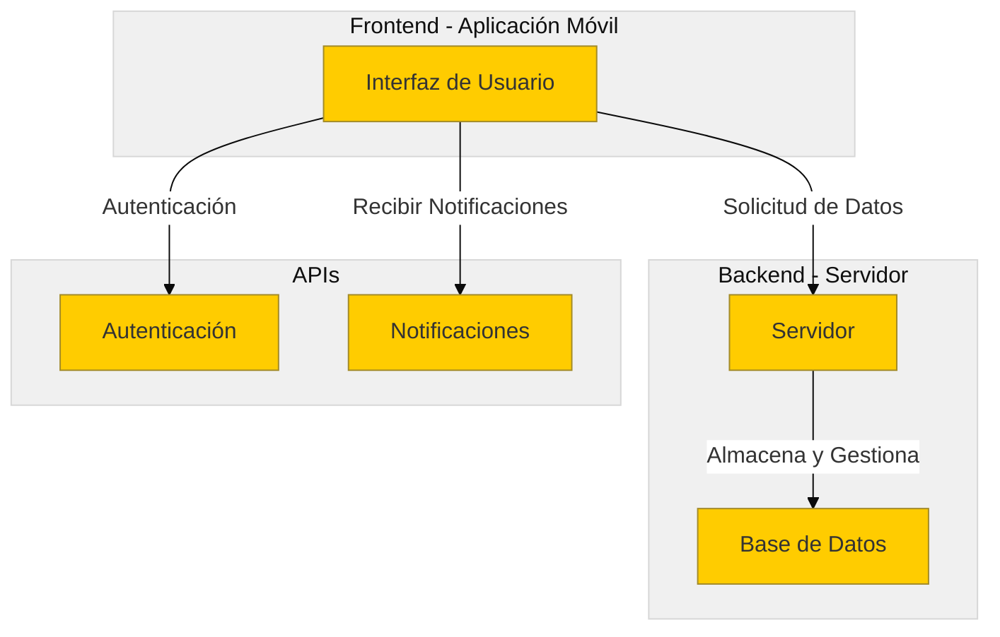

Para ilustrar la estructura general del software, incluyendo las interacciones y conexiones entre diferentes componentes del sistema.

Diagrama de arquitectura de software para la aplicación "TaskMaster". Este diagrama muestra la estructura general del software, incluyendo las interacciones y conexiones entre diferentes componentes del sistema. 

- **Frontend - Aplicación Móvil:**
  - Interfaz de Usuario (UI): donde los usuarios interactúan con la aplicación.

- **Backend - Servidor:**
  - Servidor: maneja las solicitudes de la aplicación móvil.
  - Base de Datos (DB): almacena información de usuarios y tareas.

- **APIs:**
  - Autenticación (Auth): gestiona el inicio de sesión y la seguridad de los usuarios.
  - Notificaciones (Notify): envía recordatorios y alertas a los usuarios.

Las flechas indican la dirección de la comunicación entre los componentes:

- La **Interfaz de Usuario** envía solicitudes de datos al **Servidor**, maneja la autenticación a través de la **API de Autenticación**, y recibe notificaciones de la **API de Notificaciones**.
- El **Servidor** interactúa con la **Base de Datos** para almacenar y gestionar los datos.

Este diagrama **MERMAID** (https://mermaid.live) lo muestra visualmente. Para copiar el código haz click en el botón "Edit this block" del siguiente dibujo/bloque:

