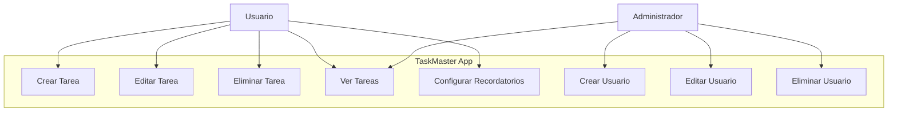

Describe las interacciones entre un sistema y sus actores externos, mostrando cómo los actores utilizan el sistema para lograr objetivos específicos, identificando los casos de uso como las diferentes funcionalidades o escenarios que el sistema ofrece.

Diagrama de caso de uso simple para la aplicación "TaskMaster" utilizando Mermaid. Este diagrama muestra las interacciones principales entre los usuarios y la aplicación, así como las funciones específicas que están disponibles para los usuarios y administradores.

- Los **Usuarios** pueden:
    
    - Crear, editar y eliminar tareas.
    - Ver todas sus tareas.
    - Configurar recordatorios.
- El **Administrador** tiene la capacidad de:
    
    - Ver tareas (esto podría incluir funciones de supervisión o auditoría).
    - Crear, editar y eliminar usuarios.

Este diagrama **MERMAID** (https://mermaid.live) lo muestra visualmente. Para copiar el código haz click en el botón "Edit this block" del siguiente dibujo/bloque:

