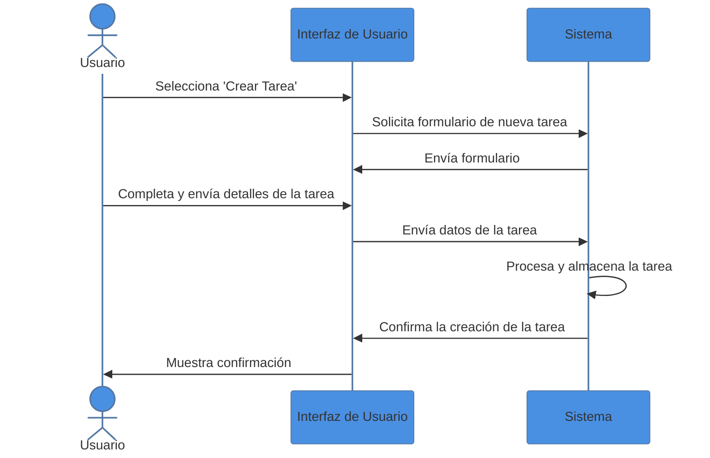

Diagrama de Secuencia para la acción de "Crear Tarea" en la aplicación "TaskMaster". Este diagrama ilustra la interacción entre el usuario, la interfaz de usuario y el sistema durante el proceso de creación de una tarea:

1. **Usuario** selecciona la opción 'Crear Tarea' en la **Interfaz de Usuario (UI)**.
2. La **UI** solicita al **Sistema** el formulario para una nueva tarea.
3. El **Sistema** envía el formulario a la **UI**.
4. El **Usuario** completa y envía los detalles de la tarea a través de la **UI**.
5. La **UI** envía los datos de la tarea al **Sistema**.
6. El **Sistema** procesa y almacena la tarea.
7. El **Sistema** envía una confirmación de creación de la tarea a la **UI**.
8. La **UI** muestra la confirmación al **Usuario**.

Este diagrama muestra la secuencia de mensajes y acciones que ocurren desde que el usuario decide crear una tarea hasta que recibe una confirmación de que la tarea ha sido creada.

