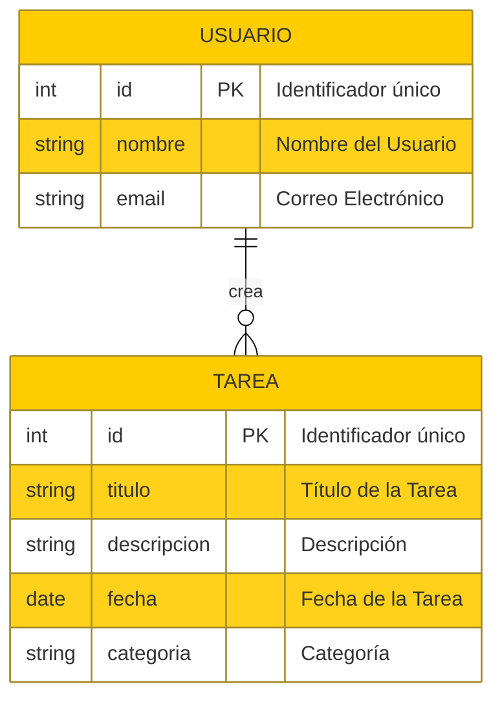

Diagrama de Entidad-Relación (ER) para la aplicación "TaskMaster". Este diagrama muestra las entidades principales y sus relaciones:

- **Entidad "USUARIO"**: Representa a los usuarios de la aplicación.    
    - **Atributos**:
        - `id`: Identificador único del usuario.
        - `nombre`: Nombre del usuario.
        - `email`: Correo electrónico del usuario.
        
- **Entidad "TAREA"**: Representa las tareas creadas por los usuarios.    
    - **Atributos**:
        - `id`: Identificador único de la tarea.
        - `titulo`: Título de la tarea.
        - `descripcion`: Descripción de la tarea.
        - `fecha`: Fecha programada para la tarea.
        - `categoria`: Categoría de la tarea (por ejemplo, trabajo, personal).

- **Relación "crea"**:
    - Un **USUARIO** puede crear varias **TAREAS** (relación uno a muchos).

