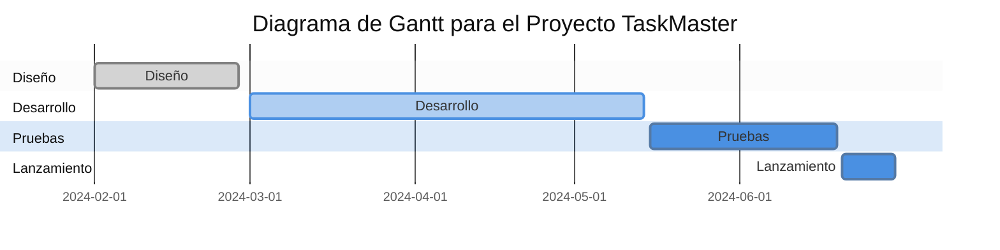

Diagrama de Gantt simplificado para el proyecto "TaskMaster". Este diagrama muestra las fases principales del proyecto y su duración estimada:

- **Diseño**: Desde el 1 de febrero hasta el 28 de febrero de 2024.
- **Desarrollo**: Del 1 de marzo al 14 de mayo de 2024.
- **Pruebas**: Del 15 de mayo al 19 de junio de 2024.
- **Lanzamiento**: Del 20 al 30 de junio de 2024.

Cada barra horizontal representa una fase del proyecto, mostrando visualmente cuándo comienza y termina cada fase. Este tipo de diagrama es muy útil para la planificación y seguimiento de proyectos, ya que proporciona una visión clara de la programación y la superposición de actividades.

