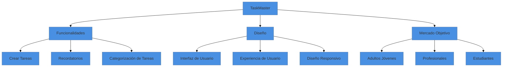

Este mapa mental se centra en distintas áreas clave del proyecto:

- **Núcleo: "TaskMaster"**
    
    - Ramificaciones principales: Funcionalidades, Diseño, Mercado Objetivo.
- **Funcionalidades:**
    
    - Crear Tareas: Función para añadir nuevas tareas.
    - Recordatorios: Configuración de alertas para las tareas.
    - Categorización de Tareas: Organizar tareas por categorías como trabajo, personal, estudio.
- **Diseño:**
    
    - Interfaz de Usuario (UI): Aspecto visual de la aplicación.
    - Experiencia de Usuario (UX): Facilidad y eficiencia de uso.
    - Diseño Responsivo: Adecuación a diferentes dispositivos y tamaños de pantalla.
- **Mercado Objetivo:**
    
    - Adultos Jóvenes: Enfocado a jóvenes profesionales.
    - Profesionales: Diseñado para quienes necesitan organización en su trabajo.
    - Estudiantes: Funciones útiles para la gestión de tareas académicas.

Este mapa mental es una representación visual y simplificada de los aspectos principales del proyecto.

Para visualizar este diagrama puedes usar un editor de Mermaid:

