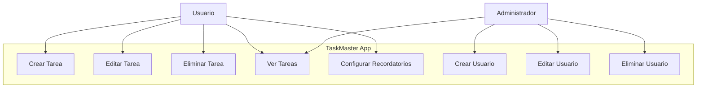

Diagrama de caso de uso simple para la aplicación "TaskMaster" utilizando Mermaid. Este diagrama muestra las interacciones principales entre los usuarios y la aplicación, así como las funciones específicas que están disponibles para los usuarios y administradores.

- Los **Usuarios** pueden:
    
    - Crear, editar y eliminar tareas.
    - Ver todas sus tareas.
    - Configurar recordatorios.
- El **Administrador** tiene la capacidad de:
    
    - Ver tareas (esto podría incluir funciones de supervisión o auditoría).
    - Crear, editar y eliminar usuarios.

Este es un ejemplo básico y puede ser ampliado o modificado para incluir más detalles según las necesidades del proyecto

