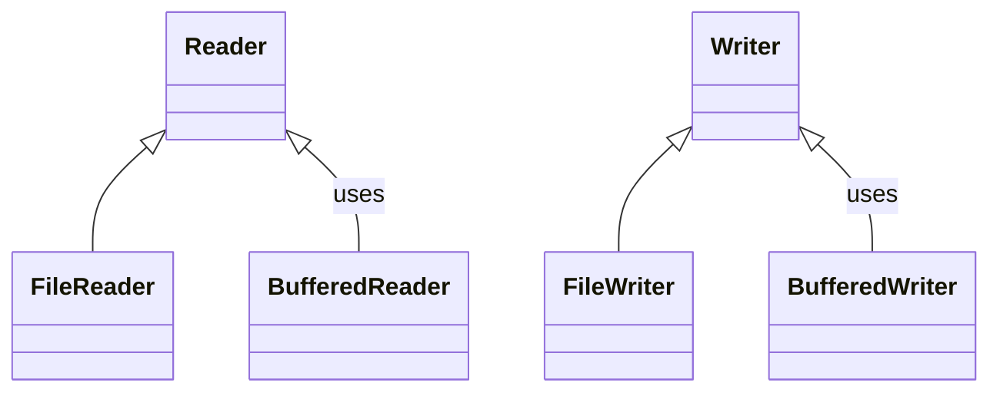
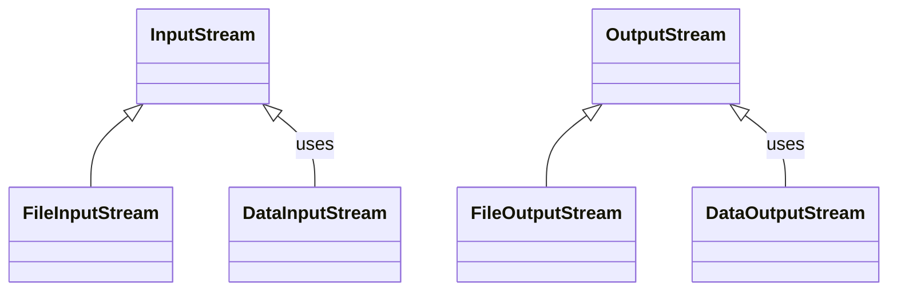

### 1. Introducción al acceso a datos

#### 1.1 Concepto de acceso a datos

**Definición:**

- El "acceso a datos" se refiere a las técnicas y métodos que permiten a una aplicación interactuar con fuentes de datos, sean estas bases de datos, archivos de texto, archivos binarios, entre otros.
    
- En este módulo, se centra en el acceso a datos a través de archivos utilizando Java.
    

**Componentes fundamentales:**

- **Archivo**: Conjunto de datos relacionados almacenados en un sistema de archivos.
    
- **Stream**: Flujo o secuencia de datos de entrada (lectura) o de salida (escritura).
    
- **Buffer**: Área de almacenamiento temporal utilizada para mejorar la eficiencia de las operaciones de I/O.
    
- Introducción a las clases y métodos comúnmente utilizados en Java para el acceso a datos (`File`, `InputStream`, `OutputStream`, `Reader`, `Writer`, etc.).
    

#### 1.2 Importancia del manejo de archivos en Java

**Fundamentación:**

- El manejo de archivos permite la persistencia de datos (los datos siguen existiendo tras finalizar el programa).
    
- Facilita el intercambio de información entre programas y el análisis posterior.
    

**Aplicaciones prácticas:**

- Almacenamiento y recuperación de información: configuraciones, resultados, datos de entrada.
    
- Intercambio de datos: exportación e importación en distintos formatos (texto, JSON, XML, binario, etc.).
    
- **Logging**: registro de eventos o transacciones para monitorización y depuración.
    

**API de Java:**

- Java ofrece un amplio soporte para I/O a través de varias clases y APIs.
    

**Clases para archivos de texto:**



**Clases para archivos binarios:**



### 2. Tipos de archivos para el acceso a datos

#### 2.1 Archivos de texto (Plain Text)

**Definición y características:**

- Archivos que contienen caracteres legibles y estructurados en líneas.
    
- Sencillos de leer y escribir, editables con cualquier editor de texto, sin metadatos complejos.
    

**Nota:** La explicación detallada de lectura y escritura con `FileReader`/`BufferedReader` y `FileWriter`/`BufferedWriter` se concentra en la **Sección 4** para evitar redundancias.

#### 2.2 Archivos binarios

**Definición y características:**

- Contienen información en un formato no legible por humanos; requieren programas específicos.
    
- Permiten almacenar una gran variedad de tipos de datos y suelen ser eficientes en I/O.
    

**Nota:** El uso de `FileInputStream`/`DataInputStream` y `FileOutputStream`/`DataOutputStream` se desarrolla de forma práctica en la **Sección 5**.

#### 2.3 Archivos JSON y XML

**Definición y características:**

- JSON y XML son formatos de intercambio de datos legibles por humanos y máquinas.
    
- JSON suele ser más conciso; XML ofrece etiquetas anidadas más verbosas y posibilidades como atributos, esquemas, etc.
    

**Nota:** El trabajo con JSON (Jackson) y XML (JAXB) se aborda en la **Sección 6**.

### 3. Creación de un proyecto básico en Java

**Introducción y planificación:**

- Configuración del entorno y creación de un proyecto básico de lectura/escritura de archivos.
    

**Creación del proyecto:**

- Guía paso a paso: clase Java, estructura básica (`public static void main(String[] args)`), y primeras operaciones con `File`, `FileReader` y `FileWriter`.
    

**Ejemplo básico (sin buffers):**

```java
import java.io.File;
import java.io.FileReader;
import java.io.FileWriter;
import java.io.IOException;

public class AccesoDatos {

    public static void main(String[] args) {
        AccesoDatos accesoDatos = new AccesoDatos();

        // Escribir datos en el archivo
        String textoParaEscribir = "Hola, ¡bienvenidos al curso de Acceso a Datos!";
        accesoDatos.escribirArchivo("datos.txt", textoParaEscribir);

        // Leer datos del archivo
        accesoDatos.leerArchivo("datos.txt");
    }

    /**
     * Método para escribir texto en un archivo
     */
    public void escribirArchivo(String nombreArchivo, String texto) {
        try {
            FileWriter writer = new FileWriter(new File(nombreArchivo));
            writer.write(texto);
            writer.close();
            System.out.println("Datos escritos exitosamente en el archivo.");
        } catch (IOException e) {
            System.err.println("Error al escribir en el archivo: " + e.getMessage());
        }
    }

    /**
     * Método para leer texto de un archivo
     */
    public void leerArchivo(String nombreArchivo) {
        try {
            FileReader reader = new FileReader(new File(nombreArchivo));
            int caracter;
            System.out.println("Leyendo datos del archivo:");
            while ((caracter = reader.read()) != -1) {
                System.out.print((char) caracter);
            }
            reader.close();
            System.out.println();
        } catch (IOException e) {
            System.err.println("Error al leer el archivo: " + e.getMessage());
        }
    }
}
```

**Ejemplo con buffers (recomendado):**

```java
import java.io.BufferedReader;
import java.io.BufferedWriter;
import java.io.FileReader;
import java.io.FileWriter;
import java.io.IOException;

public class AccesoDatos {

    public static void main(String[] args) {
        AccesoDatos accesoDatos = new AccesoDatos();
        
        // Escribir datos en el archivo
        String textoParaEscribir = "Hola, ¡bienvenidos al curso de Acceso a Datos!";
        accesoDatos.escribirArchivo("datos.txt", textoParaEscribir);
        
        // Leer datos del archivo
        accesoDatos.leerArchivo("datos.txt");
    }

    /**
     * Método para escribir texto en un archivo
     */
    public void escribirArchivo(String nombreArchivo, String texto) {
        try (BufferedWriter writer = new BufferedWriter(new FileWriter(nombreArchivo))) {
            writer.write(texto);
            System.out.println("Datos escritos exitosamente en el archivo.");
        } catch (IOException e) {
            System.err.println("Error al escribir en el archivo: " + e.getMessage());
        }
    }

    /**
     * Método para leer texto de un archivo
     */
    public void leerArchivo(String nombreArchivo) {
        try (BufferedReader reader = new BufferedReader(new FileReader(nombreArchivo))) {
            String linea;
            System.out.println("Leyendo datos del archivo:");
            while ((linea = reader.readLine()) != null) {
                System.out.println(linea);
            }
        } catch (IOException e) {
            System.err.println("Error al leer el archivo: " + e.getMessage());
        }
    }
}
```

**Prueba del proyecto:**

- Ejecución y primeras pruebas con el depurador de la IDE.
    

### 4. Acceso a datos utilizando archivos de texto en Java

#### 4.1 Lectura de archivos de texto (`BufferedReader`, `FileReader`)

**Teoría:**

1. `FileReader`: permite leer caracteres de un archivo.
    
2. `BufferedReader`: envuelve a `Reader` para lectura eficiente por líneas.
    

**Demostración:**

```java
import java.io.BufferedReader;
import java.io.FileReader;
import java.io.IOException;

public class LecturaArchivoTexto {
    public static void main(String[] args) {
        try (BufferedReader bufferedReader = new BufferedReader(new FileReader("datos.txt"))) {
            String linea;
            while ((linea = bufferedReader.readLine()) != null) {
                System.out.println(linea);
            }
        } catch (IOException e) {
            System.err.println("Ocurrió un error al leer el archivo: " + e.getMessage());
        }
    }
}
```

---

#### 4.2 Escritura en archivos de texto (`BufferedWriter`, `FileWriter`)

**Teoría:**

1. `FileWriter`: escribe caracteres a un archivo (sobrescritura o _append_).
    
2. `BufferedWriter`: escritura eficiente con _buffer_ y utilidades como `newLine()`.
    

**Demostración:**

```java
import java.io.BufferedWriter;
import java.io.FileWriter;
import java.io.IOException;

public class EscrituraArchivoTexto {
    public static void main(String[] args) {
        try (BufferedWriter bufferedWriter = new BufferedWriter(new FileWriter("datos.txt"))) {
            bufferedWriter.write("Hola, bienvenidos al curso de Acceso a Datos.");
            bufferedWriter.newLine();
            bufferedWriter.write("Aprenderemos a trabajar con archivos en Java.");
        } catch (IOException e) {
            System.err.println("Ocurrió un error al escribir en el archivo: " + e.getMessage());
        }
    }
}
```

---

#### 4.3 Ejemplo práctico (texto)

Aplicación que solicita texto por consola, lo guarda en `datosUsuario.txt` y lo lee después.

```java
import java.io.*;
import java.util.Scanner;

public class EjemploPractico {
    public static void main(String[] args) {
        Scanner scanner = new Scanner(System.in);

        System.out.println("Por favor, introduzca un texto para guardar en el archivo:");
        String textoUsuario = scanner.nextLine();

        try (FileWriter writer = new FileWriter("datosUsuario.txt")) {
            writer.write(textoUsuario);
        } catch (IOException e) {
            System.err.println("Error al escribir en el archivo: " + e.getMessage());
        }

        try (FileReader reader = new FileReader("datosUsuario.txt")) {
            int caracter;
            System.out.println("Texto guardado en el archivo:");
            while ((caracter = reader.read()) != -1) {
                System.out.print((char) caracter);
            }
            System.out.println();
        } catch (IOException e) {
            System.err.println("Error al leer el archivo: " + e.getMessage());
        }

        scanner.close();
    }
}
```

### 5. Acceso a datos utilizando archivos   en Java

#### 5.1 Lectura de archivos binarios (`DataInputStream`, `FileInputStream`)

**Teoría:**

- `FileInputStream`: lectura de bytes de un archivo.
    
- `DataInputStream`: lectura de tipos primitivos y cadenas UTF de forma portable.
    

**Demostración:**

```java
import java.io.DataInputStream;
import java.io.FileInputStream;
import java.io.IOException;

public class LecturaBinaria {
    public static void main(String[] args) {
        try (DataInputStream dataInputStream = new DataInputStream(new FileInputStream("datos.bin"))) {
            int edad = dataInputStream.readInt();
            float altura = dataInputStream.readFloat();
            boolean matriculado = dataInputStream.readBoolean();

            System.out.println("Edad: " + edad);
            System.out.println("Altura: " + altura);
            System.out.println("Matriculado: " + matriculado);
        } catch (IOException e) {
            System.err.println("Error al leer el archivo: " + e.getMessage());
        }
    }
}
```

#### 5.2 Escritura en archivos binarios (`DataOutputStream`, `FileOutputStream`)

**Teoría:**

- `FileOutputStream`: escritura de bytes.
    
- `DataOutputStream`: escritura de primitivos y cadenas UTF de forma portable.
    

**Demostración:**

```java
import java.io.DataOutputStream;
import java.io.FileOutputStream;
import java.io.IOException;

public class EscrituraBinaria {
    public static void main(String[] args) {
        try (DataOutputStream dataOutputStream = new DataOutputStream(new FileOutputStream("datos.bin"))) {
            dataOutputStream.writeInt(25);
            dataOutputStream.writeFloat(1.75f);
            dataOutputStream.writeBoolean(true);
            System.out.println("Datos escritos exitosamente en el archivo.");
        } catch (IOException e) {
            System.err.println("Error al escribir en el archivo: " + e.getMessage());
        }
    }
}
```

#### 5.3 Ejemplo práctico (binario)

Aplicación que pide datos por consola, los guarda en `datosUsuario.bin` y luego los lee.

```java
import java.io.*;
import java.util.Scanner;

public class EjemploPracticoBinario {
    public static void main(String[] args) {
        Scanner scanner = new Scanner(System.in);

        System.out.print("Introduzca su edad: ");
        int edad = scanner.nextInt();

        System.out.print("Introduzca su altura: ");
        float altura = scanner.nextFloat();

        System.out.print("¿Está matriculado? (true/false): ");
        boolean matriculado = scanner.nextBoolean();

        try (DataOutputStream dos = new DataOutputStream(new FileOutputStream("datosUsuario.bin"))) {
            dos.writeInt(edad);
            dos.writeFloat(altura);
            dos.writeBoolean(matriculado);
        } catch (IOException e) {
            System.err.println("Error al escribir en el archivo: " + e.getMessage());
        }

        try (DataInputStream dis = new DataInputStream(new FileInputStream("datosUsuario.bin"))) {
            System.out.println("\nDatos guardados en el archivo:");
            System.out.println("Edad: " + dis.readInt());
            System.out.println("Altura: " + dis.readFloat());
            System.out.println("Matriculado: " + dis.readBoolean());
        } catch (IOException e) {
            System.err.println("Error al leer el archivo: " + e.getMessage());
        }

        scanner.close();
    }
}
```

**Gestión de múltiples registros (binario):**

```java
import java.io.*;
import java.util.Scanner;

public class GestionDatosBinarios {

    public static void main(String[] args) {
        Scanner scanner = new Scanner(System.in);

        while (true) {
            System.out.println("\nMenú:");
            System.out.println("1. Añadir una persona");
            System.out.println("2. Mostrar todas las personas");
            System.out.println("3. Salir");
            System.out.print("Elija una opción: ");
            int opcion = scanner.nextInt();
            scanner.nextLine();

            if (opcion == 1) {
                System.out.print("Introduzca el nombre: ");
                String nombre = scanner.nextLine();

                System.out.print("Introduzca la edad: ");
                int edad = scanner.nextInt();

                System.out.print("Introduzca la altura: ");
                float altura = scanner.nextFloat();
                scanner.nextLine();

                System.out.print("¿Está matriculado? (true/false): ");
                boolean matriculado = scanner.nextBoolean();
                scanner.nextLine();

                Persona persona = new Persona(nombre, edad, altura, matriculado);
                escribirPersona(persona);

            } else if (opcion == 2) {
                mostrarPersonas();
            } else {
                break;
            }
        }

        scanner.close();
    }

    public static void escribirPersona(Persona persona) {
        try (DataOutputStream dos = new DataOutputStream(new FileOutputStream("datosPersonas.bin", true))) {
            dos.writeUTF(persona.nombre);
            dos.writeInt(persona.edad);
            dos.writeFloat(persona.altura);
            dos.writeBoolean(persona.matriculado);
            System.out.println("Persona añadida exitosamente.");
        } catch (IOException e) {
            System.err.println("Error al escribir en el archivo: " + e.getMessage());
        }
    }

    public static void mostrarPersonas() {
        try (DataInputStream dis = new DataInputStream(new FileInputStream("datosPersonas.bin"))) {
            while (true) {
                String nombre = dis.readUTF();
                int edad = dis.readInt();
                float altura = dis.readFloat();
                boolean matriculado = dis.readBoolean();

				Persona persona = new Persona(nombre, edad, altura, matriculado);
	            System.out.println(persona);
               
            }
        } catch (EOFException e) {
            // Fin de archivo alcanzado
        } catch (IOException e) {
            System.err.println("Error al leer el archivo: " + e.getMessage());
        }
    }
}

class Persona implements Serializable {
    String nombre;
    int edad;
    float altura;
    boolean matriculado;
    float peso;

	long 

    Persona(String nombre, int edad, float altura, boolean matriculado) {
        this.nombre = nombre;
        this.edad = edad;
        this.altura = altura;
        this.matriculado = matriculado;
    }
}
```


### 6. Acceso a datos utilizando archivos JSON y XML en Java

#### 6.1 Bibliotecas para trabajar con JSON y XML en Java

Se utilizan dos bibliotecas principales: **Jackson** (JSON) y **JAXB** (XML).

1. **Jackson**
    
    - **Descripción**: Serializa/deserializa objetos Java en JSON y viceversa.
        
    - **Maven**:
        
        ```xml
        <dependency>
           <groupId>com.fasterxml.jackson.core</groupId>
           <artifactId>jackson-databind</artifactId>
           <version>2.12.3</version>
        </dependency>
        ```
        
2. **JAXB (Java API for XML Binding)**
    
    - **Descripción**: Conversión entre objetos Java y XML.
        
    - **Maven**:
        
        ```xml
        <dependency>
           <groupId>javax.xml.bind</groupId>
           <artifactId>jaxb-api</artifactId>
           <version>2.3.1</version>
        </dependency>
        ```
        

#### 6.2 Lectura y escritura de archivos JSON y XML

1. **JSON (Jackson)**: `ObjectMapper` con `writeValue` y `readValue`.
    
2. **XML (JAXB)**: `JAXBContext` con `Marshaller`/`Unmarshaller`.
    

#### 6.3 Ejemplos prácticos básicos

**Ejemplo con Jackson (JSON)**

```java
import com.fasterxml.jackson.databind.ObjectMapper;
import java.io.File;
import java.io.IOException;

public class JsonExample {
    public static void main(String[] args) {
        ObjectMapper mapper = new ObjectMapper();
        Persona persona = new Persona("Juan", 30, 1.8f, true);

        try {
            // Escribir JSON
            mapper.writeValue(new File("persona.json"), persona);

            // Leer JSON
            Persona personaLeida = mapper.readValue(new File("persona.json"), Persona.class);
            System.out.println("Persona leída desde JSON: " + personaLeida.nombre);

        } catch (IOException e) {
            e.printStackTrace();
        }
    }
}
```

**Ejemplo con JAXB (XML)**

```java
import javax.xml.bind.JAXBContext;
import javax.xml.bind.JAXBException;
import javax.xml.bind.Marshaller;
import javax.xml.bind.Unmarshaller;
import java.io.File;

public class XmlExample {
    public static void main(String[] args) {
        try {
            JAXBContext context = JAXBContext.newInstance(Persona.class);
            Marshaller marshaller = context.createMarshaller();
            Unmarshaller unmarshaller = context.createUnmarshaller();

            Persona persona = new Persona("Maria", 25, 1.7f, false);

            // Escribir XML
            marshaller.marshal(persona, new File("persona.xml"));

            // Leer XML
            Persona personaLeida = (Persona) unmarshaller.unmarshal(new File("persona.xml"));
            System.out.println("Persona leída desde XML: " + personaLeida.nombre);

        } catch (JAXBException e) {
            e.printStackTrace();
        }
    }
}
```

**Listas de objetos (JSON/JAXB)**

**JSON (Jackson)**

```java
import com.fasterxml.jackson.core.type.TypeReference;
import com.fasterxml.jackson.databind.ObjectMapper;
import java.io.File;
import java.io.IOException;
import java.util.ArrayList;
import java.util.List;
import java.util.Scanner;

public class JsonExampleLista {

    public static void main(String[] args) {
        List<Persona> personas = new ArrayList<>();
        ObjectMapper mapper = new ObjectMapper();
        Scanner scanner = new Scanner(System.in);

        try {
            File file = new File("personas.json");
            if (file.exists()) {
                personas = mapper.readValue(file, new TypeReference<List<Persona>>() {});
            }

            System.out.print("Introduzca el nombre: ");
            String nombre = scanner.nextLine();
            System.out.print("Introduzca la edad: ");
            int edad = scanner.nextInt();
            System.out.print("Introduzca la altura: ");
            float altura = scanner.nextFloat();
            System.out.print("¿Está matriculado? (true/false): ");
            boolean matriculado = scanner.nextBoolean();

            personas.add(new Persona(nombre, edad, altura, matriculado));

            mapper.writeValue(file, personas);

            personas = mapper.readValue(file, new TypeReference<List<Persona>>() {});
            for (Persona p : personas) {
                System.out.println(p);
            }

        } catch (IOException e) {
            e.printStackTrace();
        }
    }
}
```

**XML (JAXB)**

```java
import javax.xml.bind.*;
import javax.xml.bind.annotation.XmlElement;
import java.io.File;
import java.util.ArrayList;
import java.util.List;
import java.util.Scanner;

public class XmlExampleLista {

    public static void main(String[] args) {
        List<Persona> personas = new ArrayList<>();
        Scanner scanner = new Scanner(System.in);

        try {
            JAXBContext context = JAXBContext.newInstance(PersonasWrapper.class);
            Marshaller marshaller = context.createMarshaller();
            Unmarshaller unmarshaller = context.createUnmarshaller();

            File file = new File("personas.xml");
            if (file.exists()) {
                PersonasWrapper wrapper = (PersonasWrapper) unmarshaller.unmarshal(file);
                personas = wrapper.getPersonas();
            }

            System.out.print("Introduzca el nombre: ");
            String nombre = scanner.nextLine();
            System.out.print("Introduzca la edad: ");
            int edad = scanner.nextInt();
            System.out.print("Introduzca la altura: ");
            float altura = scanner.nextFloat();
            System.out.print("¿Está matriculado? (true/false): ");
            boolean matriculado = scanner.nextBoolean();

            personas.add(new Persona(nombre, edad, altura, matriculado));

            PersonasWrapper wrapper = new PersonasWrapper();
            wrapper.setPersonas(personas);
            marshaller.marshal(wrapper, file);

            wrapper = (PersonasWrapper) unmarshaller.unmarshal(file);
            for (Persona p : wrapper.getPersonas()) {
                System.out.println(p);
            }

        } catch (JAXBException e) {
            e.printStackTrace();
        }
    }

    // Clase auxiliar para envolver la lista de personas en XML
    public static class PersonasWrapper {
        private List<Persona> personas;

        @XmlElement(name = "persona")
        public List<Persona> getPersonas() {
            return personas;
        }

        public void setPersonas(List<Persona> personas) {
            this.personas = personas;
        }
    }
}
```


#### 6.4 Ejemplos avanzados

##### Ejemplo práctico JSON con Jackson

- **Dependencias Maven (Jackson + utilidades recomendadas):**
    
    ```xml
    <!-- Núcleo Jackson -->
    <dependency>
      <groupId>com.fasterxml.jackson.core</groupId>
      <artifactId>jackson-databind</artifactId>
      <version>2.17.2</version>
    </dependency>
    <dependency>
      <groupId>com.fasterxml.jackson.core</groupId>
      <artifactId>jackson-core</artifactId>
      <version>2.17.2</version>
    </dependency>
    <!-- Tipos Java Time (si en el futuro hay LocalDate, etc.) -->
    <dependency>
      <groupId>com.fasterxml.jackson.datatype</groupId>
      <artifactId>jackson-datatype-jsr310</artifactId>
      <version>2.17.2</version>
    </dependency>
    <!-- JSONPath para consultas -->
    <dependency>
      <groupId>com.jayway.jsonpath</groupId>
      <artifactId>json-path</artifactId>
      <version>2.9.0</version>
    </dependency>
    <!-- Validador de JSON Schema (ejemplo con NetworkNT) -->
    <dependency>
      <groupId>com.networknt</groupId>
      <artifactId>json-schema-validator</artifactId>
      <version>1.5.3</version>
    </dependency>
    ```
    
- **Modelo de datos (recomendación: `BigDecimal` para importes):**
    
    ```java
    import java.math.BigDecimal;
    
    public record Empleado(
        int id,
        String nombre,
        String dni,
        BigDecimal sueldoMax,
        BigDecimal sueldoMin,
        BigDecimal sueldoMedio
    ) {}
    ```
    
- **Configuración del `ObjectMapper` (lectura/escritura segura y precisa):**
    
    ```java
    import com.fasterxml.jackson.databind.*;
    import com.fasterxml.jackson.core.*;
    import com.fasterxml.jackson.datatype.jsr310.JavaTimeModule;
    
    ObjectMapper mapper = new ObjectMapper();
    
    // Legibilidad (solo para desarrollo)
    mapper.enable(SerializationFeature.INDENT_OUTPUT);
    
    // Precisión numérica: leer floats como BigDecimal y escribir sin notación científica
    mapper.configure(DeserializationFeature.USE_BIG_DECIMAL_FOR_FLOATS, true);
    mapper.configure(SerializationFeature.WRITE_BIGDECIMAL_AS_PLAIN, true);
    
    // Robustez frente a campos inesperados en entrada
    mapper.configure(DeserializationFeature.FAIL_ON_UNKNOWN_PROPERTIES, false);
    
    // Soporte para Java Time (si se usa en el futuro)
    mapper.registerModule(new JavaTimeModule());
    
    // Seguridad básica: evitar polimorfismo implícito
    mapper.deactivateDefaultTyping(); // por claridad; no usar DefaultTyping sin validador explícito
    ```
    
- **Lectura (deserialización) de una lista de empleados:**
    
    ```java
    import com.fasterxml.jackson.core.type.TypeReference;
    import java.nio.file.*;
    import java.nio.charset.StandardCharsets;
    import java.util.List;
    
    Path jsonPath = Paths.get("empleados.json");
    String json = Files.readString(jsonPath, StandardCharsets.UTF_8);
    
    List<Empleado> empleados = mapper.readValue(json, new TypeReference<List<Empleado>>() {});
    ```
    
- **Escritura (serialización) con “pretty print” en UTF-8:**
    
    ```java
    import java.nio.file.Files;
    import java.util.List;
    
    String salida = mapper.writerWithDefaultPrettyPrinter()
                          .writeValueAsString(empleados);
    
    Files.writeString(Paths.get("empleados.json"), salida, StandardCharsets.UTF_8);
    ```
    
- **Streaming para archivos grandes (procesamiento incremental):**
    
    ```java
    import com.fasterxml.jackson.core.*;
    import com.fasterxml.jackson.databind.ObjectReader;
    import java.io.File;
    import java.util.ArrayList;
    import java.util.List;
    
    List<Empleado> resultado = new ArrayList<>();
    ObjectReader reader = mapper.readerFor(Empleado.class);
    
    try (JsonParser p = mapper.getFactory().createParser(new File("empleados.json"))) {
        if (p.nextToken() != JsonToken.START_ARRAY) {
            throw new IllegalStateException("Se esperaba un array como raíz");
        }
        while (p.nextToken() == JsonToken.START_OBJECT) {
            Empleado emp = reader.readValue(p);  // consume el objeto actual
            resultado.add(emp);
        }
        // p.nextToken() ahora debe ser END_ARRAY
    }
    ```
    
- **Consultas con JSONPath (selecciones análogas a XPath):**
    
    ```java
    import com.jayway.jsonpath.JsonPath;
    import com.jayway.jsonpath.ReadContext;
    import java.util.List;
    import java.math.BigDecimal;
    
    String documento = Files.readString(Paths.get("empleados.json"), StandardCharsets.UTF_8);
    ReadContext ctx = JsonPath.parse(documento);
    
    // DNI del primer empleado
    String dni0 = ctx.read("$[0].dni");
    
    // Todos los sueldos medios
    List<BigDecimal> sueldosMedios = ctx.read("$[*].sueldoMedio");
    
    // Empleados con sueldoMax > 2000
    List<Object> filtrados = ctx.read("$[?(@.sueldoMax > 2000)]");
    ```
    
- **Validación con JSON Schema (garantizar estructura y tipos):**
    
    - **Schema de ejemplo (`empleados.schema.json`)**:
        
        ```json
        {
          "$schema": "https://json-schema.org/draft/2020-12/schema",
          "title": "Empleados",
          "type": "array",
          "items": {
            "type": "object",
            "required": ["id", "nombre", "dni", "sueldoMax", "sueldoMin", "sueldoMedio"],
            "additionalProperties": false,
            "properties": {
              "id":        { "type": "integer", "minimum": 1 },
              "nombre":    { "type": "string",  "minLength": 1 },
              "dni":       { "type": "string",  "pattern": "^[0-9]{8}[A-Z]$" },
              "sueldoMax": { "type": "number" },
              "sueldoMin": { "type": "number" },
              "sueldoMedio": { "type": "number" }
            }
          }
        }
        ```
        
    - **Código de validación (NetworkNT):**
        
        ```java
        import com.fasterxml.jackson.databind.JsonNode;
        import com.networknt.schema.*;
        
        JsonNode jsonNode = mapper.readTree(Files.readString(Paths.get("empleados.json"), StandardCharsets.UTF_8));
        JsonSchemaFactory factory = JsonSchemaFactory.getInstance(SpecVersion.VersionFlag.V202012);
        JsonSchema schema = factory.getSchema(Files.newBufferedReader(Paths.get("empleados.schema.json")));
        
        Set<ValidationMessage> errores = schema.validate(jsonNode);
        if (!errores.isEmpty()) {
            errores.forEach(msg -> System.err.println("Error de schema: " + msg));
            throw new IllegalArgumentException("JSON inválido respecto al schema");
        }
        ```
        
- **Anotaciones Jackson útiles (mapeo fino):**
    
    ```java
    import com.fasterxml.jackson.annotation.*;
    
    public record Empleado(
        @JsonProperty("id") int id,
        @JsonProperty("nombre") String nombre,
        @JsonProperty("dni") String dni,
        @JsonProperty("sueldoMax") java.math.BigDecimal sueldoMax,
        @JsonProperty("sueldoMin") java.math.BigDecimal sueldoMin,
        @JsonProperty("sueldoMedio") java.math.BigDecimal sueldoMedio
    ) {}
    
    // Omitir campos nulos al serializar
    // mapper.setSerializationInclusion(JsonInclude.Include.NON_NULL);
    
    // Ignorar propiedades desconocidas a nivel de tipo
    // @JsonIgnoreProperties(ignoreUnknown = true)
    ```
    
- **Conversores personalizados (cuando el formato difiere):**
    
    ```java
    import com.fasterxml.jackson.core.JsonGenerator;
    import com.fasterxml.jackson.databind.SerializerProvider;
    import com.fasterxml.jackson.databind.ser.std.StdSerializer;
    import java.io.IOException;
    import java.math.BigDecimal;
    
    // Serializador que fuerza 2 decimales en BigDecimal
    public class BigDecimal2Serializer extends StdSerializer<BigDecimal> {
        public BigDecimal2Serializer() { super(BigDecimal.class); }
        @Override
        public void serialize(BigDecimal value, JsonGenerator gen, SerializerProvider serializers) throws IOException {
            gen.writeNumber(value.setScale(2, BigDecimal.ROUND_HALF_UP));
        }
    }
    // Registro:
    // SimpleModule m = new SimpleModule().addSerializer(BigDecimal.class, new BigDecimal2Serializer());
    // mapper.registerModule(m);
    ```
    
- **Criterios rápidos de diseño de estructura:**
    
    - **Objeto vs. Array**:
        
        - Objeto (`{}`) para entidades **nombradas** por clave (propiedades).
            
        - Array (`[]`) para **colecciones ordenadas** y homogéneas (empleados).
            
    - **Tipos numéricos**: usar `BigDecimal` en Java y `number` en JSON; el separador decimal es **punto**.
        
    - **Campos opcionales**: si se prevén ausencias, considerar `@JsonInclude(Include.NON_NULL)` y reflejarlo en el **schema** (`"required": [...]` adecuado).
        
- **Archivos grandes y rendimiento:**
    
    - Preferir **streaming** (como arriba) o `MappingIterator` (`reader.readValues(...)`) para no cargar todo en memoria.
        
    - Reutilizar `ObjectReader`/`ObjectWriter` configurados; son **thread-safe** y más rápidos en escenarios repetitivos.
        
    - Evitar `pretty print` en producción si el tamaño es crítico.
        
- **Consideraciones de seguridad al deserializar:**
    
    - **No** activar tipado por defecto global (`activateDefaultTyping`) salvo que use un `PolymorphicTypeValidator` restrictivo y una lista de tipos de confianza.
        
    - Validar con **JSON Schema** cuando los datos procedan de terceros.
        
    - Establecer límites razonables (tamaño máximo de entrada, profundidad de anidamiento) a nivel de canal de entrada.
        
- **I/O y codificación:**
    
    - Leer y escribir siempre en **UTF-8**.
        
    - Controlar separadores de línea si el entorno lo exige (`System.lineSeparator()` si se construyen cadenas manualmente).
        

Con este ejemplo, queda cubierta la serialización/deserialización habitual con Jackson, las consultas intermedias con JSONPath, la validación con JSON Schema y el tratamiento de archivos grandes.

##### Ejemplo práctico XML con JDOM

- **Dependencia Maven (JDOM 2):**
    
    ```xml
    <dependency>
      <groupId>org.jdom</groupId>
      <artifactId>jdom2</artifactId>
      <version>2.0.6.1</version>
    </dependency>
    ```
    
- **Lectura (parseo seguro) y mapeo a objetos:**
    
    ```java
    import org.jdom2.*;
    import org.jdom2.input.SAXBuilder;
    import org.jdom2.input.sax.XMLReaders;
    import java.math.BigDecimal;
    import java.nio.file.*;
    import java.nio.charset.StandardCharsets;
    import java.util.*;
    
    // POJO mínimo (puede ajustarse a su modelo)
    record Empleado(int id, String nombre, String dni,
                    BigDecimal sueldoMax, BigDecimal sueldoMin, BigDecimal sueldoMedio) {}
    
    Path path = Paths.get("empleados.xml");
    
    SAXBuilder builder = new SAXBuilder(XMLReaders.NONVALIDATING);
    // Endurecer el parser frente a XXE y entidades externas
    builder.setFeature("http://apache.org/xml/features/disallow-doctype-decl", true);
    builder.setFeature("http://xml.org/sax/features/external-general-entities", false);
    builder.setFeature("http://xml.org/sax/features/external-parameter-entities", false);
    
    Document doc = builder.build(path.toFile());
    Element raiz = doc.getRootElement(); // <empleados>
    List<Element> nodos = raiz.getChildren("empleado");
    
    List<Empleado> empleados = new ArrayList<>();
    for (Element e : nodos) {
        int id = Integer.parseInt(e.getChildText("id"));
        String nombre = e.getChildText("nombre");
        String dni = e.getChildText("dni");
        BigDecimal max = new BigDecimal(e.getChildText("sueldoMax"));
        BigDecimal min = new BigDecimal(e.getChildText("sueldoMin"));
        BigDecimal medio = new BigDecimal(e.getChildText("sueldoMedio"));
        empleados.add(new Empleado(id, nombre, dni, max, min, medio));
    }
    ```
    
- **Escritura (generación con formato legible):**
    
    ```java
    import org.jdom2.output.XMLOutputter;
    import org.jdom2.output.Format;
    import java.io.Writer;
    import java.nio.file.Files;
    
    Element root = new Element("empleados");
    Document docOut = new Document(root);
    
    for (Empleado emp : empleados) {
        Element e = new Element("empleado");
        e.addContent(new Element("id").setText(String.valueOf(emp.id())));
        e.addContent(new Element("nombre").setText(emp.nombre()));
        e.addContent(new Element("dni").setText(emp.dni()));
        e.addContent(new Element("sueldoMax").setText(emp.sueldoMax().toPlainString()));
        e.addContent(new Element("sueldoMin").setText(emp.sueldoMin().toPlainString()));
        e.addContent(new Element("sueldoMedio").setText(emp.sueldoMedio().toPlainString()));
        root.addContent(e);
    }
    
    XMLOutputter out = new XMLOutputter(
        Format.getPrettyFormat()
              .setEncoding("UTF-8")
              .setIndent("  ")
    );
    
    try (Writer w = Files.newBufferedWriter(Paths.get("empleados.xml"), StandardCharsets.UTF_8)) {
        out.output(docOut, w);
    }
    ```
    
- **Consultas con XPath (JDOM 2):**
    
    ```java
    import org.jdom2.filter.Filters;
    import org.jdom2.xpath.XPathExpression;
    import org.jdom2.xpath.XPathFactory;
    
    XPathFactory xpf = XPathFactory.instance();
    XPathExpression<Element> expr = xpf.compile(
        "/empleados/empleado[dni='12345678X']",
        Filters.element()
    );
    List<Element> encontrados = expr.evaluate(doc);
    ```
    
- **Validación con XSD (esquema):**
    
    ```java
    import javax.xml.XMLConstants;
    import javax.xml.validation.Schema;
    import javax.xml.validation.SchemaFactory;
    import java.io.File;
    
    SchemaFactory sf = SchemaFactory.newInstance(XMLConstants.W3C_XML_SCHEMA_NS_URI);
    Schema schema = sf.newSchema(new File("empleados.xsd"));
    
    SAXBuilder valBuilder = new SAXBuilder(XMLReaders.XSDVALIDATING);
    valBuilder.setSchema(schema);
    // Mantener endurecimiento de parser
    valBuilder.setFeature("http://apache.org/xml/features/disallow-doctype-decl", true);
    valBuilder.setFeature("http://xml.org/sax/features/external-general-entities", false);
    valBuilder.setFeature("http://xml.org/sax/features/external-parameter-entities", false);
    
    Document validado = valBuilder.build(Paths.get("empleados.xml").toFile());
    ```
    
    **Esqueleto mínimo de `empleados.xsd`:**
    
    ```xml
    <?xml version="1.0" encoding="UTF-8"?>
    <xs:schema xmlns:xs="http://www.w3.org/2001/XMLSchema" elementFormDefault="qualified">
      <xs:element name="empleados">
        <xs:complexType>
          <xs:sequence>
            <xs:element name="empleado" maxOccurs="unbounded">
              <xs:complexType>
                <xs:sequence>
                  <xs:element name="id" type="xs:integer"/>
                  <xs:element name="nombre" type="xs:string"/>
                  <xs:element name="dni" type="xs:string"/>
                  <xs:element name="sueldoMax" type="xs:decimal"/>
                  <xs:element name="sueldoMin" type="xs:decimal"/>
                  <xs:element name="sueldoMedio" type="xs:decimal"/>
                </xs:sequence>
              </xs:complexType>
            </xs:element>
          </xs:sequence>
        </xs:complexType>
      </xs:element>
    </xs:schema>
    ```
    
- **Espacios de nombres (namespaces), si procede:**
    
    ```java
    import org.jdom2.Namespace;
    
    Namespace hr = Namespace.getNamespace("hr", "http://ejemplo.org/hr");
    Element rootNs = new Element("empleados", hr);
    Element emp = new Element("empleado", hr);
    rootNs.addContent(emp);
    ```
    
- **Criterios rápidos “atributo vs. elemento”:**
    
    - **Atributo**: metadatos, identificadores, banderas cortas, datos invariables (p. ej., `id`).
        
    - **Elemento**: datos de negocio, contenidos extensibles, valores que pueden tener estructura interna, listas o texto largo (p. ej., `nombre`, `sueldoMedio`).
        
- **Archivos grandes:** si el tamaño crece mucho, conviene **procesar en streaming** (SAX/StAX, p. ej., Woodstox) en lugar de construir todo el árbol con JDOM.
    
- **Codificación y formato:** usar **UTF-8**, evitar conversión implícita de decimales a `double` (transformarlos con `BigDecimal`), y emitir con **pretty print** solo en entornos de desarrollo (en producción puede interesar salida compacta).


### 7. Buenas prácticas y manejo de excepciones

#### 7.1 Manejo de excepciones en operaciones de I/O

**Importancia del manejo de excepciones:**

- Previene fallos catastróficos, mejora la experiencia de usuario, facilita la depuración, asegura liberación de recursos, mejora la seguridad y separa la lógica de error.
    

**Clases de excepciones comunes:**

- `IOException` (genérica), `FileNotFoundException` (archivo no encontrado), entre otras.
    

**Bloques `try`-`catch`-`finally`:**

```java
import java.io.*;

public class Main {
    public static void main(String[] args) {
        File file = new File("path/to/file.txt");

        try {
            FileReader fileReader = new FileReader(file);
            BufferedReader bufferedReader = new BufferedReader(fileReader);
            String line = bufferedReader.readLine();
            System.out.println(line);
        } catch (FileNotFoundException e) {
            System.err.println("Archivo no encontrado: " + e.getMessage());
        } catch (IOException e) {
            System.err.println("Error de I/O: " + e.getMessage());
        } finally {
            System.out.println("Este bloque 'finally' siempre se ejecuta.");
        }
    }
}
```

**Ejemplo práctico (excepciones):**

```java
import java.io.*;

public class ExceptionHandlingExample {
    public static void main(String[] args) {
        FileReader fr = null;

        try {
            fr = new FileReader("archivo_no_existente.txt");
        } catch (FileNotFoundException e) {
            System.out.println("Error: El archivo no pudo ser encontrado.");
            e.printStackTrace();
        } finally {
            if (fr != null) {
                try {
                    fr.close();
                } catch (IOException e) {
                    System.out.println("Error: No se pudo cerrar el archivo.");
                    e.printStackTrace();
                }
            }
        }
    }
}
```

#### 7.2 Buenas prácticas para el acceso a datos

- Cierre de recursos.
    
- Uso de _try-with-resources_.
    
- Manejo adecuado de datos sensibles.
    

**Ejemplo con _try-with-resources_:**

```java
import java.io.*;

public class BestPracticesExample {
    public static void main(String[] args) {
        try (FileReader fr = new FileReader("archivo_existente.txt");
             BufferedReader br = new BufferedReader(fr)) {

            String linea;
            while ((linea = br.readLine()) != null) {
                System.out.println(linea);
            }
        } catch (FileNotFoundException e) {
            System.out.println("Error: El archivo no pudo ser encontrado.");
            e.printStackTrace();
        } catch (IOException e) {
            System.out.println("Error: Se produjo un error de I/O.");
            e.printStackTrace();
        }
    }
}
```

### 8. Actividades prácticas optativas

#### 8.1 Proyecto: Sistema de Gestión de Datos Personales

- **Descripción:** Aplicación en Java que permita ingresar, almacenar y recuperar detalles personales (nombre, edad, dirección) en un archivo (texto, binario, JSON o XML).
    
- **Requisitos:** Clase `Persona`, métodos de lectura/escritura, manejo de excepciones.
    

#### 8.2 Ejercicio: Manipulación de archivos de texto (biblioteca)

- **Operaciones:** añadir libro, listar libros, buscar por autor o título.
    
- **Objetivo:** Practicar lectura/escritura y excepciones en texto.
    

#### 8.3 Ejercicio: Archivos binarios (empleados)

- **Operaciones:** registrar empleado, listar empleados, buscar por nombre o puesto.
    
- **Objetivo:** Trabajar con binario, primitivos y estructuras.
    

#### 8.4 Ejercicio: JSON/XML (inventario)

- **Operaciones:** añadir producto, listar productos, buscar por código o nombre.
    
- **Objetivo:** Serialización/deserialización con Jackson/JAXB.
    

### 9. Material complementario

**Libros:**

0. **"Acceso a Datos"**: Libro de clase por Carlos Alberto Cortijo Bon.
    
1. **"Java: The Complete Reference"** – Herbert Schildt.
    
2. **"Clean Code"** – Robert C. Martin.
    

**Referencia rápida de conceptos clave:**

- "Acceso a datos", "Archivos de Texto", "Archivos Binarios", "JSON", "XML".
    

**Recursos adicionales:**

1. **Documentación oficial de Java**: [https://docs.oracle.com/javase/8/docs/](https://docs.oracle.com/javase/8/docs/)
    
2. **Coursera (Programación en Java)**: [https://www.coursera.org/](https://www.coursera.org/)
    
3. **Stack Overflow (Java)**: [https://stackoverflow.com/questions/tagged/java](https://stackoverflow.com/questions/tagged/java)
