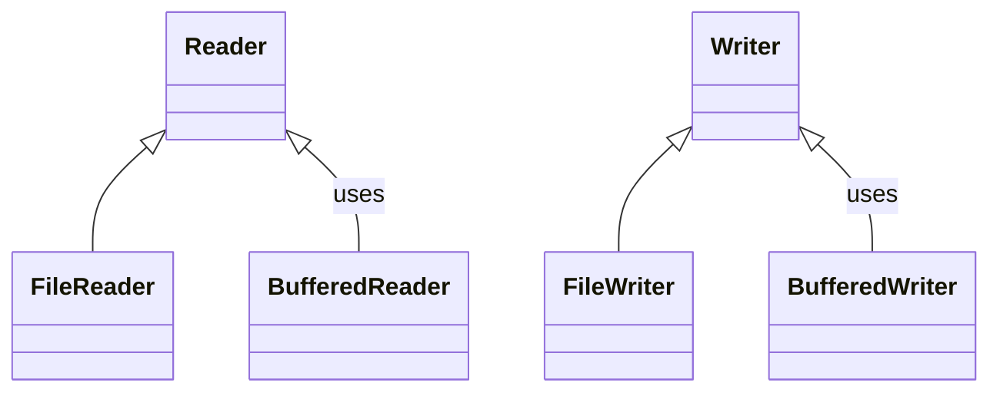
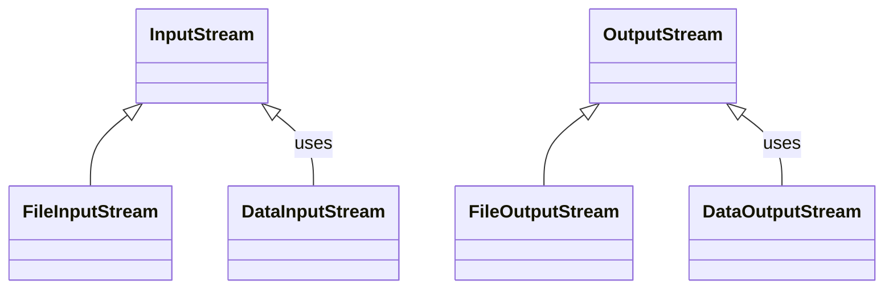

# Sesión 1 (1 hora y 30 minutos):
## 1. Introducción al acceso a datos (30 minutos)

### 1.1 Concepto de acceso a datos (15 minutos)

**Definición (5 minutos):**
- El "acceso a datos" se refiere a las técnicas y métodos que permiten a una aplicación interáctuar con fuentes de datos, sean estas bases de datos, archivos de texto, archivos binarios, entre otros.
- En este módulo, nos concentraremos en el acceso a datos a través de archivos utilizando Java.

**Componentes fundamentales (10 minutos):**
- **Archivo**: Un conjunto de datos relacionados almacenados en una computadora.
- **Stream**: Un flujo de datos o secuencia que puede ser de entrada (para leer datos) o de salida (para escribir datos).
- **Buffer**: Un área de almacenamiento temporal utilizada para mejorar la eficiencia de las operaciones de lectura y escritura.
- Introducción a las clases y métodos comúnmente utilizados en Java para el acceso a datos (File, InputStream, OutputStream, Reader, Writer, etc.), estos se tratarán con más detalle en las siguientes secciones.


### 1.2 Importancia del manejo de archivos en Java (15 minutos)

**Fundamentación (5 minutos):**
- El manejo de archivos es una habilidad fundamental para cualquier programador, ya que permite la persistencia de datos, es decir, que los datos sigan existiendo incluso después de que el programa haya terminado.
- A través del manejo de archivos, podemos compartir información entre distintos programas y realizar análisis de datos complejos.

**Aplicaciones Prácticas (5 minutos):**
- Almacenamiento y recuperación de información: guardar configuraciones, guardar resultados, leer datos de entrada, entre otros.
- Intercambio de datos: exportar e importar datos en diferentes formatos (texto, JSON, XML, binario, etc.) facilita el intercambio de información entre sistemas diferentes.
- Logging: registrar eventos o transacciones para el análisis posterior, una herramienta indispensable para el monitoreo y el debugging.

**API de Java (5 minutos):**
- Java ofrece un amplio soporte para operaciones de I/O a través de varias clases y APIs, facilitando así el manejo de archivos de diversas formas y tipos.

Clases para archivos de texto:



Clases para archivos binarios:




## 2. Tipos de archivos para el acceso a datos (30 minutos)

### 2.1 Archivos de texto (Plain Text) (10 minutos)

**Definición y características (3 minutos):**
- Los archivos de texto: archivos que contienen caracteres legibles y están estructurados en líneas.
- Algunas de sus características: sencillos de leer y escribir, pueden ser editados con cualquier editor de texto, no contienen metadatos complejos, etc.

**Uso en Java (7 minutos):**
- **Para operaciones de Lectura**:
  - Utilización de clases como `FileReader` y `BufferedReader` para leer archivos de texto en Java.

Explicación en detalle sobre la clase `FileReader` en Java.

#### FileReader en Java

`FileReader` es una clase en Java que proporciona métodos para leer caracteres de un archivo. Es una subclase de la clase `InputStreamReader`, que es una clase para leer flujos de caracteres. Aquí están algunos puntos clave sobre `FileReader`:

##### 1. **Creación de una Instancia de FileReader**

Para leer un archivo, primero necesitamos crear una instancia de `FileReader`, especificando el archivo que queremos leer, que puede ser un objeto `File` o una ruta de archivo como una cadena:

```java
FileReader reader = new FileReader("ruta/del/archivo.txt");
```

##### 2. **Lectura de Caracteres**

La clase `FileReader` provee varios métodos para leer caracteres del archivo:

- `int read()`: Lee un solo carácter y devuelve su valor como un entero (devuelve -1 si se ha alcanzado el final del archivo).
- `int read(char[] cbuf)`: Lee varios caracteres a la vez en una matriz de caracteres (devuelve el número de caracteres leídos o -1 si se ha alcanzado el final del archivo).
- `int read(char[] cbuf, int off, int len)`: Lee varios caracteres en una parte de la matriz de caracteres especificada.

##### 3. **Manejo de Excepciones**

Las operaciones de I/O pueden generar excepciones, así que se deben manejar utilizando bloques try-catch o declarando que el método puede lanzar una excepción del tipo IOException:

```java
try {
    FileReader reader = new FileReader("ruta/del/archivo.txt");
    int caracter;
    while((caracter = reader.read()) != -1) {
        System.out.print((char) caracter);
    }
    reader.close();
} catch (IOException e) {
    e.printStackTrace();
}
```

##### 4. **Cierre del Archivo**

Es fundamental cerrar el `FileReader` después de usarlo para liberar los recursos asociados. Esto se puede hacer utilizando el método `close()`:

```java
reader.close();
```

##### 5. **Uso con try-with-resources**

A partir de Java 7, puedes utilizar la declaración try-with-resources, que garantiza que el `FileReader` se cerrará automáticamente al final del bloque try:

```java
try (FileReader reader = new FileReader("ruta/del/archivo.txt")) {
    int caracter;
    while((caracter = reader.read()) != -1) {
        System.out.print((char) caracter);
    }
} catch (IOException e) {
    e.printStackTrace();
}
```

##### 6. **Buffering**

Aunque `FileReader` puede leer caracteres directamente de un archivo, generalmente es más eficiente usarlo con `BufferedReader`, que puede reducir el número de operaciones de I/O al leer múltiples caracteres a la vez.

##### 7. **Codificación de Caracteres**

`FileReader` utiliza la codificación de caracteres predeterminada del sistema. Si deseas especificar una codificación de caracteres diferente, considera usar `InputStreamReader` con `FileInputStream`, lo que permite especificar la codificación de caracteres.

##### 8. **Desempeño**

Para archivos grandes, es recomendable usar `FileReader` con `BufferedReader` para aumentar el rendimiento, ya que `BufferedReader` lee grandes bloques de datos a la vez en lugar de leer carácter por carácter, reduciendo así el tiempo de I/O.

```java
try (BufferedReader br = new BufferedReader(new FileReader("ruta/del/archivo.txt"))) {
    String linea;
    while ((linea = br.readLine()) != null) {
        System.out.println(linea);
    }
} catch (IOException e) {
    e.printStackTrace();
}
```

  - Demostración con un ejemplo sencillo de cómo leer un archivo de texto línea por línea.
```java
import java.io.BufferedReader;
import java.io.FileReader;
import java.io.IOException;

public class LecturaArchivo {
    public static void main(String[] args) {
        try (BufferedReader br = new BufferedReader(new FileReader("ejemplo.txt"))) {
            String linea;
            while ((linea = br.readLine()) != null) {
                System.out.println(linea);
            }
        } catch (IOException e) {
            System.err.println("Error al leer el archivo: " + e.getMessage());
        }
    }
}
```

- **Escritura**:
  - Utilización de clases como `FileWriter` y `BufferedWriter` para escribir en archivos de texto en Java.

Explicación sobre la clase `FileWriter` en Java:

#### FileWriter en Java

La clase `FileWriter` es una clase en Java que se utiliza para escribir caracteres en un archivo. Forma parte del paquete `java.io` y es una subclase de la clase `OutputStreamWriter`, que es una clase de escritura de flujo de caracteres. Aquí están algunos detalles clave sobre `FileWriter`:

##### 1. **Creación y Apertura de Archivos**

Cuando creamos una instancia de `FileWriter`, Java intenta abrir el archivo especificado. Si el archivo no existe, se creará uno nuevo. Aquí está un ejemplo sencillo:

```java
FileWriter writer = new FileWriter("archivo.txt");
```

##### 2. **Modos de Escritura**

`FileWriter` permite escribir en un archivo en dos modos: 
- **Modo Sobrescribir** (default): Sobrescribe el contenido del archivo existente.
- **Modo Append**: Añade el nuevo contenido al final del archivo existente, conservando el contenido original. Se activa pasando un segundo argumento `true` al constructor:

  ```java
  FileWriter writer = new FileWriter("archivo.txt", true);
  ```

##### 3. **Escribir en el Archivo**

El `FileWriter` ofrece varios métodos para escribir en el archivo:

- `write(int c)`: Escribe un solo carácter.
- `write(char[] cbuf)`: Escribe una matriz de caracteres.
- `write(String str)`: Escribe una cadena de caracteres.
- `write(String str, int off, int len)`: Escribe una parte de una cadena de caracteres.

Por ejemplo,

```java
writer.write("Hola Mundo");
```

##### 4. **Cierre del Archivo**

Es importante cerrar el `FileWriter` una vez que hemos terminado de escribir en el archivo para liberar los recursos asociados. Se hace utilizando el método `close()`:

```java
writer.close();
```

##### 5. **Manejo de Excepciones**

Las operaciones de I/O pueden generar excepciones, por lo que es necesario manejarlas utilizando bloques try-catch o declarando que el método puede lanzar una excepción de tipo IOException:

```java
try {
    FileWriter writer = new FileWriter("archivo.txt");
    writer.write("Hola Mundo");
    writer.close();
} catch (IOException e) {
    e.printStackTrace();
}
```

##### 6. **Uso con try-with-resources**

Desde Java 7, puedes utilizar la declaración try-with-resources, que garantiza que el `FileWriter` se cerrará automáticamente al final del bloque try:

```java
try (FileWriter writer = new FileWriter("archivo.txt")) {
    writer.write("Hola Mundo");
} catch (IOException e) {
    e.printStackTrace();
}
```

##### 7. **Buffering**

Aunque `FileWriter` puede escribir caracteres directamente en un archivo, es recomendable usarlo junto con `BufferedWriter` para una escritura más eficiente, especialmente cuando se escribe una gran cantidad de texto.

##### 8. **Codificación de Caracteres**

`FileWriter` utiliza la codificación de caracteres predeterminada del sistema. Si deseas especificar una codificación de caracteres diferente, deberías considerar usar `OutputStreamWriter`.

  - Demostración con un ejemplo sencillo de cómo escribir en un archivo de texto.

```java
import java.io.BufferedWriter;
import java.io.FileWriter;
import java.io.IOException;

public class EscrituraArchivo {
    public static void main(String[] args) {
        try (BufferedWriter bw = new BufferedWriter(new FileWriter("salida.txt"))) {
            bw.write("Esto es una línea de texto.");
            bw.newLine();
            bw.write("Esto es otra línea de texto.");
        } catch (IOException e) {
            System.err.println("Error al escribir en el archivo: " + e.getMessage());
        }
    }
}
```


Dos escenarios ejemplo donde el manejo de archivos en aplicaciones Java sería muy útil:

#### Ejemplo 1. Registro y Consulta de Usuarios:

**Situación:** Una aplicación requiere mantener un registro de usuarios con su respectiva información básica como nombre, edad y correo electrónico.

**Ejemplo de Código en Java:**

```java
import java.io.FileWriter;
import java.io.FileReader;
import java.io.IOException;

public class RegistroUsuarios {

    public static void main(String[] args) {
        String archivo = "usuarios.txt";

        // Escribiendo datos de usuarios en el archivo
        try (FileWriter writer = new FileWriter(archivo)) {
            writer.write("Nombre,Edad,Correo\n");
            writer.write("Juan,30,juan@example.com\n");
            writer.write("Maria,25,maria@example.com\n");
        } catch (IOException e) {
            System.out.println("Error escribiendo en el archivo: " + e.getMessage());
        }

        // Leyendo datos de usuarios del archivo
        try (FileReader reader = new FileReader(archivo)) {
            int caracter;
            while ((caracter = reader.read()) != -1) {
                System.out.print((char) caracter);
            }
        } catch (IOException e) {
            System.out.println("Error leyendo el archivo: " + e.getMessage());
        }
    }
}
```

#### Ejemplo 2. Manejo de Configuraciones de una Aplicación:

**Situación:** Un software que necesita guardar y leer configuraciones del usuario, como preferencias de visualización, desde un archivo.

**Ejemplo de Código en Java:**

```java
import java.util.Properties;
import java.io.FileOutputStream;
import java.io.FileInputStream;
import java.io.IOException;

public class ConfiguracionApp {

    public static void main(String[] args) {
        Properties prop = new Properties();
        String archivo = "config.properties";

        // Guardando configuraciones en un archivo
        try (FileOutputStream output = new FileOutputStream(archivo)) {
            prop.setProperty("tema", "oscuro");
            prop.setProperty("fuente", "Arial");
            prop.store(output, null);
        } catch (IOException io) {
            System.out.println("Error guardando configuraciones: " + io.getMessage());
        }

        // Leyendo configuraciones desde un archivo
        try (FileInputStream input = new FileInputStream(archivo)) {
            prop.load(input);
            System.out.println("Tema: " + prop.getProperty("tema"));
            System.out.println("Fuente: " + prop.getProperty("fuente"));
        } catch (IOException ex) {
            System.out.println("Error leyendo configuraciones: " + ex.getMessage());
        }
    }
}
```

En ambos ejemplos, se demuestra cómo realizar operaciones básicas de escritura y lectura de archivos en Java, una habilidad esencial para manipular datos persistentes en aplicaciones reales.


### 2.2 Archivos binarios (10 minutos)

**Definición y características (3 minutos):**
- Los archivos binarios contienen información en un formato que solo puede ser leído por programas específicos, no son legibles por humanos.
- Algunas características: pueden almacenar una amplia variedad de tipos de datos, son más eficientes para la lectura y escritura en comparación con los archivos de texto.

**Uso en Java (7 minutos):**
- **Lectura**:
  -  Explicación detallada de las clases `FileInputStream` y `DataInputStream` en Java, específicamente para la lectura de archivos binarios:

#### FileInputStream

##### 1. **Descripción General**
La clase `FileInputStream` es parte del paquete java.io y se utiliza para leer bytes de un archivo. Es adecuado para leer datos binarios.

##### 2. **Creación de una Instancia**
Para crear una instancia de `FileInputStream`, necesitarás especificar la ruta del archivo desde el cual deseas leer, esto puede hacerse usando un objeto `File` o una cadena que representa la ruta del archivo:

```java
FileInputStream fis = new FileInputStream("ruta/del/archivo.bin");
```

##### 3. **Métodos de Lectura**
`FileInputStream` proporciona varios métodos para leer datos:

- `int read()`: lee un byte de datos y devuelve su valor como un entero (retorna -1 si se ha alcanzado el final del archivo).
- `int read(byte[] b)`: lee varios bytes a la vez en un array de bytes.
- `int read(byte[] b, int off, int len)`: lee varios bytes en una parte del array de bytes especificada.

##### 4. **Manejo de Excepciones**
Al igual que con otras clases de IO, las operaciones de IO pueden generar excepciones, y estas deben manejarse correctamente, generalmente con un bloque try-catch:

```java
try {
    FileInputStream fis = new FileInputStream("ruta/del/archivo.bin");
} catch (FileNotFoundException e) {
    e.printStackTrace();
}
```

#### DataInputStream

##### 1. **Descripción General**
La clase `DataInputStream` permite leer tipos de datos primitivos (como int, float, double, etc.) de una manera portable desde un flujo de entrada. Generalmente se usa en combinación con `FileInputStream` para leer datos binarios.

##### 2. **Creación de una Instancia**
Para crear una instancia de `DataInputStream`, necesitarás envolver un objeto `InputStream` (como un `FileInputStream`) dentro de un `DataInputStream`:

```java
DataInputStream dis = new DataInputStream(new FileInputStream("ruta/del/archivo.bin"));
```

##### 3. **Métodos de Lectura**
`DataInputStream` proporciona varios métodos para leer datos primitivos:

- `int readInt()`: lee un entero de 4 bytes.
- `float readFloat()`: lee un float de 4 bytes.
- `double readDouble()`: lee un double de 8 bytes.
- `String readUTF()`: lee una cadena en formato UTF-8.
- Entre otros...

##### 4. **Manejo de Excepciones**
Al igual que con `FileInputStream`, las operaciones de IO pueden generar excepciones que deben manejarse con bloques try-catch:

```java
try {
    DataInputStream dis = new DataInputStream(new FileInputStream("ruta/del/archivo.bin"));
    int i = dis.readInt();
    float f = dis.readFloat();
    // y así sucesivamente...
} catch (IOException e) {
    e.printStackTrace();
}
```

##### 5. **Uso en Conjunto**
`FileInputStream` y `DataInputStream` a menudo se usan juntos para leer datos binarios de un archivo:

```java
try (DataInputStream dis = new DataInputStream(new FileInputStream("ruta/del/archivo.bin"))) {
    int i = dis.readInt();
    float f = dis.readFloat();
    // ...
} catch (IOException e) {
    e.printStackTrace();
}
```

  - Demostración con un ejemplo básico de cómo leer datos de un archivo binario utilizando `FileInputStream` y `DataInputStream` en Java:

```java
import java.io.DataInputStream;
import java.io.FileInputStream;
import java.io.IOException;

public class LeerDatosBinarios {

    public static void main(String[] args) {
        
        String ruta = "ruta/del/archivo.bin";  // Ajusta la ruta según necesitas
        
        try (DataInputStream dis = new DataInputStream(new FileInputStream(ruta))) {
            
            // Supongamos que el archivo contiene un entero, un flotante y una cadena en este orden
            int valorEntero = dis.readInt();       // Leer un entero de 4 bytes
            float valorFlotante = dis.readFloat(); // Leer un float de 4 bytes
            String valorCadena = dis.readUTF();    // Leer una cadena en formato UTF-8
            
            System.out.println("Valor Entero: " + valorEntero);
            System.out.println("Valor Flotante: " + valorFlotante);
            System.out.println("Valor Cadena: " + valorCadena);
            
        } catch (IOException e) {
            System.err.println("Ocurrió un error durante la lectura del archivo: " + e.getMessage());
        }
    }
}
```

En este ejemplo:

1. Importamos las clases necesarias.
2. Usamos un bloque try-with-resources para manejar el flujo de entrada, lo que garantiza que el flujo se cerrará automáticamente al final del bloque, incluso si ocurre una excepción.
3. Creamos una nueva instancia de `DataInputStream` envolviendo una nueva instancia de `FileInputStream` apuntando a la ruta del archivo binario.
4. Usamos los métodos `readInt()`, `readFloat()` y `readUTF()` de `DataInputStream` para leer un entero, un flotante y una cadena del archivo, respectivamente, y luego los imprimimos a la consola.
5. Capturamos cualquier excepción de `IOException` que pueda ocurrir y la manejamos imprimiendo un mensaje de error en la consola.


- **Escritura**:
  - Introducir clases como `FileOutputStream` y `DataOutputStream` para la escritura de archivos binarios en Java.
  - Demostración con un ejemplo básico de cómo escribir datos en un archivo binario.


#### 2.3 Archivos JSON y XML (10 minutos)

**Definición y características (3 minutos):**
- Explicar que tanto JSON como XML son formatos de archivo utilizados para estructurar y almacenar datos de una manera que es tanto legible por humanos como por máquinas.
- Comparar brevemente JSON y XML, destacando las características principales de cada uno.

**Uso en Java (7 minutos):**
- **JSON**:
  - Presentar bibliotecas populares en Java para trabajar con JSON, como Jackson o Gson.
  - Demostrar con un ejemplo básico cómo parsear y crear archivos JSON en Java.
- **XML**:
  - Introducir la biblioteca JAXB que es comúnmente utilizada para trabajar con XML en Java.
  - Demostrar con un ejemplo básico cómo parsear y crear archivos XML en Java.


## 3.  Creación de un proyecto básico en Java (15 minutos)

**Introducción y planificación (5 minutos):**
- Explicar que ahora los estudiantes utilizarán el entorno configurado para crear un proyecto básico en Java.
- Dar una breve introducción sobre qué consistirá el proyecto básico: un pequeño programa que será capaz de leer y escribir en un archivo (preludio a las siguientes sesiones).

**Creación del proyecto (7 minutos):**
- Guía paso a paso para la creación del proyecto:
  - Creación de una nueva clase Java en la IDE.
  - Estructura básica de una clase Java: explicación sobre `public static void main(String[] args)` y su importancia.
  - Introducción a la API de I/O de Java: explicación breve sobre las clases `File`, `FileReader`, y `FileWriter`.
  - Escribir un código básico para leer y escribir en un archivo de texto usando las clases mencionadas.

Un ejemplo básico usando únicamente `File`, `FileWriter` y `FileReader` para escribir y leer en un archivo de texto:

```java
import java.io.File;
import java.io.FileReader;
import java.io.FileWriter;
import java.io.IOException;

public class AccesoDatos {

    public static void main(String[] args) {
        AccesoDatos accesoDatos = new AccesoDatos();

        // Escribir datos en el archivo
        String textoParaEscribir = "Hola, ¡bienvenidos al curso de Acceso a Datos!";
        accesoDatos.escribirArchivo("datos.txt", textoParaEscribir);

        // Leer datos del archivo
        accesoDatos.leerArchivo("datos.txt");
    }

    /**
     * Método para escribir texto en un archivo
     */
    public void escribirArchivo(String nombreArchivo, String texto) {
        try {
            FileWriter writer = new FileWriter(new File(nombreArchivo));
            writer.write(texto);
            writer.close();
            System.out.println("Datos escritos exitosamente en el archivo.");
        } catch (IOException e) {
            System.err.println("Error al escribir en el archivo: " + e.getMessage());
        }
    }

    /**
     * Método para leer texto de un archivo
     */
    public void leerArchivo(String nombreArchivo) {
        try {
            FileReader reader = new FileReader(new File(nombreArchivo));
            int caracter;
            System.out.println("Leyendo datos del archivo:");
            while ((caracter = reader.read()) != -1) {
                System.out.print((char) caracter);
            }
            reader.close();
            System.out.println();
        } catch (IOException e) {
            System.err.println("Error al leer el archivo: " + e.getMessage());
        }
    }
}
```

Aquí utilizando buffers para mejorar el rendimiento y simplificar el código al escribir y leer líneas completas a cada iteración del bucle while.

```java
import java.io.BufferedReader;
import java.io.BufferedWriter;
import java.io.FileReader;
import java.io.FileWriter;
import java.io.IOException;

public class AccesoDatos {

    public static void main(String[] args) {
        AccesoDatos accesoDatos = new AccesoDatos();
        
        // Escribir datos en el archivo
        String textoParaEscribir = "Hola, ¡bienvenidos al curso de Acceso a Datos!";
        accesoDatos.escribirArchivo("datos.txt", textoParaEscribir);
        
        // Leer datos del archivo
        accesoDatos.leerArchivo("datos.txt");
    }

    /**
     * Método para escribir texto en un archivo
     */
    public void escribirArchivo(String nombreArchivo, String texto) {
        try (BufferedWriter writer = new BufferedWriter(new FileWriter(nombreArchivo))) {
            writer.write(texto);
            System.out.println("Datos escritos exitosamente en el archivo.");
        } catch (IOException e) {
            System.err.println("Error al escribir en el archivo: " + e.getMessage());
        }
    }

    /**
     * Método para leer texto de un archivo
     */
    public void leerArchivo(String nombreArchivo) {
        try (BufferedReader reader = new BufferedReader(new FileReader(nombreArchivo))) {
            String linea;
            System.out.println("Leyendo datos del archivo:");
            while ((linea = reader.readLine()) != null) {
                System.out.println(linea);
            }
        } catch (IOException e) {
            System.err.println("Error al leer el archivo: " + e.getMessage());
        }
    }
}
```


**Prueba del proyecto (3 minutos):**
- Ejecución del proyecto para demostrar que funciona como se esperaba.
- Introducción a la depuración: mostrar cómo usar el depurador en la IDE para identificar y corregir errores.

# Sesión 2 (1 hora y 30 minutos):
### 4. Acceso a datos utilizando archivos de texto en Java (45 minutos)

#### 4.1 Lectura de archivos de texto (BufferedReader, FileReader) - (15 minutos)

**Teoría (5 minutos):**
1. Explicación sobre la clase `FileReader`: una clase que permite leer caracteres de un archivo.
2. Introducción a la clase `BufferedReader`: una clase que se utiliza para leer texto de una entrada de caracteres, almacenando caracteres en un buffer para proporcionar una lectura más eficiente.

**Demostración (10 minutos):**
- Creación de un ejemplo práctico para mostrar cómo usar `FileReader` y `BufferedReader` para leer un archivo de texto.

```java
import java.io.BufferedReader;
import java.io.FileReader;
import java.io.IOException;

public class LecturaArchivoTexto {
    public static void main(String[] args) {
        try {
            // Creación de un objeto FileReader para leer el archivo 'datos.txt'
            FileReader fileReader = new FileReader("datos.txt");

            // Envoltura del FileReader con un BufferedReader para una lectura más eficiente
            BufferedReader bufferedReader = new BufferedReader(fileReader);

            // Leer y mostrar cada línea del archivo hasta llegar al final (linea null)
            String linea;
            while ((linea = bufferedReader.readLine()) != null) {
                System.out.println(linea);
            }

            // Cerrar el BufferedReader para liberar recursos
            bufferedReader.close();
        } catch (IOException e) {
            System.err.println("Ocurrió un error al leer el archivo: " + e.getMessage());
        }
    }
}
```

---

#### 4.2 Escritura en archivos de texto (BufferedWriter, FileWriter) - (15 minutos)

**Teoría (5 minutos):**
1. Explicación sobre la clase `FileWriter`: una clase que permite escribir caracteres a un archivo.
2. Introducción a la clase `BufferedWriter`: una clase que proporciona una forma eficiente de escribir caracteres en un archivo, almacenando los caracteres en un buffer antes de escribirlos.

**Demostración (10 minutos):**
- Creación de un ejemplo práctico para mostrar cómo usar `FileWriter` y `BufferedWriter` para escribir en un archivo de texto.

```java
import java.io.BufferedWriter;
import java.io.FileWriter;
import java.io.IOException;

public class EscrituraArchivoTexto {
    public static void main(String[] args) {
        try {
            // Creación de un objeto FileWriter para escribir en el archivo 'datos.txt'
            FileWriter fileWriter = new FileWriter("datos.txt");

            // Envoltura del FileWriter con un BufferedWriter para una escritura más eficiente
            BufferedWriter bufferedWriter = new BufferedWriter(fileWriter);

            // Escribir líneas de texto en el archivo
            bufferedWriter.write("Hola, bienvenidos al curso de Acceso a Datos.");
            bufferedWriter.newLine();
            bufferedWriter.write("Aprenderemos a trabajar con archivos en Java.");

            // Cerrar el BufferedWriter para liberar recursos y guardar los cambios en el archivo
            bufferedWriter.close();
        } catch (IOException e) {
            System.err.println("Ocurrió un error al escribir en el archivo: " + e.getMessage());
        }
    }
}
```

---

#### 4.3 Ejemplos prácticos - (15 minutos)

**Creación y ejecución de un proyecto pequeño (15 minutos):**
- Crear un pequeño proyecto que incorpore los conocimientos adquiridos sobre lectura y escritura de archivos en Java. Los estudiantes tendrán que crear una aplicación que sea capaz de escribir datos ingresados por el usuario en un archivo y luego leerlos y mostrarlos en consola.
- Aquí estaría bien mostrar cómo recibir input del usuario a través de la consola usando `Scanner` y luego escribir esos datos en un archivo y leerlos posteriormente.

```java
import java.io.*;
import java.util.Scanner;

public class EjemploPractico {
    public static void main(String[] args) {
        Scanner scanner = new Scanner(System.in);

        System.out.println("Por favor, introduce un texto para guardar en el archivo:");
        String textoUsuario = scanner.nextLine();

        try (FileWriter writer = new FileWriter("datosUsuario.txt")) {
            writer.write(textoUsuario);
        } catch (IOException e) {
            System.err.println("Error al escribir en el archivo: " + e.getMessage());
        }

        try (FileReader reader = new FileReader("datosUsuario.txt")) {
            int caracter;
            System.out.println("Texto guardado en el archivo:");
            while ((caracter = reader.read()) != -1) {
                System.out.print((char) caracter);
            }
            System.out.println();
        } catch (IOException e) {
            System.err.println("Error al leer el archivo: " + e.getMessage());
        }

        scanner.close();
    }
}
```

### 5. Acceso a datos utilizando archivos binarios en Java (45 minutos)

#### 5.1 Lectura de archivos binarios (DataInputStream, FileInputStream) - (15 minutos)

**Teoría (5 minutos):**
1. `FileInputStream`: Una clase que permite leer bytes de un archivo.
2. `DataInputStream`: Permite leer datos de tipos primitivos (como int, float, etc.) de una forma más cómoda y eficiente desde un InputStream (como un FileInputStream).

**Demostración (10 minutos):**
Creación de un archivo binario con algunos datos y luego utiliza `FileInputStream` y `DataInputStream` para leer y mostrar estos datos.

```java
import java.io.DataInputStream;
import java.io.FileInputStream;
import java.io.IOException;

public class LecturaBinaria {
    public static void main(String[] args) {
        try {
            FileInputStream fileInputStream = new FileInputStream("datos.bin");
            DataInputStream dataInputStream = new DataInputStream(fileInputStream);

            // Leer y mostrar datos de tipos primitivos desde el archivo
            int edad = dataInputStream.readInt();
            float altura = dataInputStream.readFloat();
            boolean matriculado = dataInputStream.readBoolean();

            System.out.println("Edad: " + edad);
            System.out.println("Altura: " + altura);
            System.out.println("Matriculado: " + matriculado);

            dataInputStream.close();
        } catch (IOException e) {
            System.err.println("Error al leer el archivo: " + e.getMessage());
        }
    }
}
```

#### 5.2 Escritura en archivos binarios (DataOutputStream, FileOutputStream) - (15 minutos)

**Teoría (5 minutos):**
1. `FileOutputStream`: Una clase que permite escribir bytes en un archivo.
2. `DataOutputStream`: Facilita la escritura de datos de tipos primitivos en un OutputStream (como un FileOutputStream) de manera eficiente.

**Demostración (10 minutos):**
Crear un programa que escriba datos de tipos primitivos en un archivo binario utilizando `FileOutputStream` y `DataOutputStream`.

```java
import java.io.DataOutputStream;
import java.io.FileOutputStream;
import java.io.IOException;

public class EscrituraBinaria {
    public static void main(String[] args) {
        try {
            FileOutputStream fileOutputStream = new FileOutputStream("datos.bin");
            DataOutputStream dataOutputStream = new DataOutputStream(fileOutputStream);

            // Escribir datos de tipos primitivos en el archivo
            dataOutputStream.writeInt(25);
            dataOutputStream.writeFloat(1.75f);
            dataOutputStream.writeBoolean(true);

            dataOutputStream.close();
            System.out.println("Datos escritos exitosamente en el archivo.");
        } catch (IOException e) {
            System.err.println("Error al escribir en el archivo: " + e.getMessage());
        }
    }
}
```

#### 5.3 Ejemplos prácticos - (15 minutos)
Crear un pequeño programa que permita al usuario ingresar datos (como edad, altura y estado de matrícula) a través de la consola, los guarde en un archivo binario y luego los lea y muestre desde ese archivo binario.

```java
import java.io.*;
import java.util.Scanner;

public class EjemploPracticoBinario {
    public static void main(String[] args) {
        Scanner scanner = new Scanner(System.in);

        System.out.print("Introduce tu edad: ");
        int edad = scanner.nextInt();

        System.out.print("Introduce tu altura: ");
        float altura = scanner.nextFloat();

        System.out.print("¿Estás matriculado? (true/false): ");
        boolean matriculado = scanner.nextBoolean();

        try (DataOutputStream dos = new DataOutputStream(new FileOutputStream("datosUsuario.bin"))) {
            dos.writeInt(edad);
            dos.writeFloat(altura);
            dos.writeBoolean(matriculado);
        } catch (IOException e) {
            System.err.println("Error al escribir en el archivo: " + e.getMessage());
        }

        try (DataInputStream dis = new DataInputStream(new FileInputStream("datosUsuario.bin"))) {
            System.out.println("\nDatos guardados en el archivo:");
            System.out.println("Edad: " + dis.readInt());
            System.out.println("Altura: " + dis.readFloat());
            System.out.println("Matriculado: " + dis.readBoolean());
        } catch (IOException e) {
            System.err.println("Error al leer el archivo: " + e.getMessage());
        }

        scanner.close();
    }
}
```

Ahora vamos a crear un programa donde se podrán añadir detalles de múltiples personas en un archivo binario y luego leerlos todos a la vez. La estructura del archivo será tal que cada "registro" en el archivo binario contenga los detalles de una persona. Vamos a crear métodos separados para facilitar la lectura y escritura de datos.

Aquí está el ejemplo con comentarios a continuación que explican cada parte del código:

```java
import java.io.*;
import java.util.Scanner;

public class GestionDatosBinarios {

    public static void main(String[] args) {
        Scanner scanner = new Scanner(System.in);

        while (true) {
            System.out.println("\nMenú:");
            System.out.println("1. Añadir una persona");
            System.out.println("2. Mostrar todas las personas");
            System.out.println("3. Salir");
            System.out.print("Elige una opción: ");
            int opcion = scanner.nextInt();
            scanner.nextLine();  // Consumir el salto de línea

            if (opcion == 1) {
                System.out.print("Introduce el nombre: ");
                String nombre = scanner.nextLine();

                System.out.print("Introduce la edad: ");
                int edad = scanner.nextInt();

                System.out.print("Introduce la altura: ");
                float altura = scanner.nextFloat();

                scanner.nextLine();  // Consumir el salto de línea

                System.out.print("¿Está matriculado? (true/false): ");
                boolean matriculado = scanner.nextBoolean();

                scanner.nextLine();  // Consumir el salto de línea

                Persona persona = new Persona(nombre, edad, altura, matriculado);
                escribirPersona(persona);

            } else if (opcion == 2) {
                mostrarPersonas();
            } else {
                break;
            }
        }

        scanner.close();
    }

    public static void escribirPersona(Persona persona) {
        try (DataOutputStream dos = new DataOutputStream(new FileOutputStream("datosPersonas.bin", true))) {
            dos.writeUTF(persona.nombre);
            dos.writeInt(persona.edad);
            dos.writeFloat(persona.altura);
            dos.writeBoolean(persona.matriculado);
            System.out.println("Persona añadida exitosamente.");
        } catch (IOException e) {
            System.err.println("Error al escribir en el archivo: " + e.getMessage());
        }
    }

    public static void mostrarPersonas() {
        try (DataInputStream dis = new DataInputStream(new FileInputStream("datosPersonas.bin"))) {
            while (true) {
                String nombre = dis.readUTF();
                int edad = dis.readInt();
                float altura = dis.readFloat();
                boolean matriculado = dis.readBoolean();

                System.out.println("\nNombre: " + nombre);
                System.out.println("Edad: " + edad);
                System.out.println("Altura: " + altura);
                System.out.println("Matriculado: " + matriculado);
            }
        } catch (EOFException e) {
            // Fin del archivo alcanzado
        } catch (IOException e) {
            System.err.println("Error al leer el archivo: " + e.getMessage());
        }
    }
}

class Persona {
    String nombre;
    int edad;
    float altura;
    boolean matriculado;

    Persona(String nombre, int edad, float altura, boolean matriculado) {
        this.nombre = nombre;
        this.edad = edad;
        this.altura = altura;
        this.matriculado = matriculado;
    }
}
```

En este programa:

1. Se crea una clase `Persona` para almacenar los detalles de una persona.
2. El método `escribirPersona` toma un objeto de `Persona` y escribe sus detalles en un archivo binario.
3. El método `mostrarPersonas` lee y muestra todos los detalles de todas las personas en el archivo binario.
4. Usamos un bucle `while (true)` en el método `main` para mantener el programa en ejecución hasta que el usuario decida salir, y dentro del bucle, proporcionamos un menú para que el usuario pueda elegir entre añadir una nueva persona o mostrar todas las personas almacenadas en el archivo binario.

Los métodos de escritura y lectura utilizan `DataOutputStream` y `DataInputStream`, respectivamente, para escribir y leer los detalles en/de un archivo binario, y usamos `FileOutputStream` con el flag `true` para permitir la escritura adicional en el archivo (en lugar de sobrescribir los datos existentes).

### Sesión 3 (1 hora y 30 minutos):
### 6. Acceso a datos utilizando archivos JSON y XML en Java (30 minutos)

#### 6.1 Bibliotecas para trabajar con JSON y XML en Java (10 minutos)
En Java, existen varias bibliotecas que facilitan el trabajo con archivos JSON y XML. Vamos a centrarnos en dos de las más populares: Jackson (para JSON) y JAXB (para XML).

1. **Jackson**
   - **Descripción**: Una biblioteca popular para serializar objetos de Java a JSON y viceversa.
   - **Agregar a tu proyecto**: Puedes agregar Jackson a tu proyecto usando Maven o Gradle. Aquí está el ejemplo usando Maven:
     ```xml
     <dependency>
        <groupId>com.fasterxml.jackson.core</groupId>
        <artifactId>jackson-databind</artifactId>
        <version>2.12.3</version>
     </dependency>
     ```
   
2. **JAXB (Java API for XML Binding)**
   - **Descripción**: Una biblioteca que facilita la conversión entre objetos Java y representaciones XML.
   - **Agregar a tu proyecto**: Similar a Jackson, puedes agregar JAXB usando Maven o Gradle. Ejemplo usando Maven:
     ```xml
     <dependency>
        <groupId>javax.xml.bind</groupId>
        <artifactId>jaxb-api</artifactId>
        <version>2.3.1</version>
     </dependency>
     ```

#### 6.2 Lectura y escritura de archivos JSON y XML (10 minutos)
1. **Lectura y escritura de archivos JSON con Jackson**
   - **Escritura**: Para escribir un objeto a un archivo JSON, usamos la clase `ObjectMapper` y su método `writeValue`.
   - **Lectura**: Para leer un archivo JSON en un objeto, también usamos la clase `ObjectMapper` pero esta vez con el método `readValue`.

2. **Lectura y escritura de archivos XML con JAXB**
   - **Escritura**: Utilizamos la clase `JAXBContext` junto con `Marshaller` para escribir objetos a archivos XML.
   - **Lectura**: Para leer un archivo XML en un objeto, utilizamos `JAXBContext` con `Unmarshaller`.

#### 6.3 Ejemplos prácticos (10 minutos)
**Ejemplo con Jackson (JSON)**

```java
import com.fasterxml.jackson.databind.ObjectMapper;

public class JsonExample {
    public static void main(String[] args) {
        ObjectMapper mapper = new ObjectMapper();
        Persona persona = new Persona("Juan", 30, 1.8f, true);

        try {
            // Escribir JSON
            mapper.writeValue(new File("persona.json"), persona);

            // Leer JSON
            Persona personaLeida = mapper.readValue(new File("persona.json"), Persona.class);
            System.out.println("Persona leída desde JSON: " + personaLeida.nombre);

        } catch (IOException e) {
            e.printStackTrace();
        }
    }
}
```

**Ejemplo con JAXB (XML)**

```java
import javax.xml.bind.JAXBContext;
import javax.xml.bind.JAXBException;
import javax.xml.bind.Marshaller;
import javax.xml.bind.Unmarshaller;
import java.io.File;

public class XmlExample {
    public static void main(String[] args) {
        try {
            JAXBContext context = JAXBContext.newInstance(Persona.class);
            Marshaller marshaller = context.createMarshaller();
            Unmarshaller unmarshaller = context.createUnmarshaller();

            Persona persona = new Persona("Maria", 25, 1.7f, false);

            // Escribir XML
            marshaller.marshal(persona, new File("persona.xml"));

            // Leer XML
            Persona personaLeida = (Persona) unmarshaller.unmarshal(new File("persona.xml"));
            System.out.println("Persona leída desde XML: " + personaLeida.nombre);

        } catch (JAXBException e) {
            e.printStackTrace();
        }
    }
}
```

En ambos ejemplos, creamos una instancia de `Persona` y luego la escribimos en un archivo usando Jackson (para JSON) o JAXB (para XML). Posteriormente, leemos el archivo creado y mostramos el nombre de la persona leída en la consola.

A continuación, dos ejemplos más elaborados para trabajar con múltiples objetos Persona y almacenarlos en archivos JSON y XML. En estos ejemplos, crearemos una lista de objetos `Persona` y le permitiremos al usuario agregar nuevas personas a la lista antes de escribir toda la lista en un archivo. También podrán leer la lista completa de personas desde el archivo.

### Ejemplo con Jackson (JSON)

```java
import com.fasterxml.jackson.core.type.TypeReference;
import com.fasterxml.jackson.databind.ObjectMapper;
import java.io.File;
import java.io.IOException;
import java.util.ArrayList;
import java.util.List;
import java.util.Scanner;

public class JsonExample {

    public static void main(String[] args) {
        List<Persona> personas = new ArrayList<>();
        ObjectMapper mapper = new ObjectMapper();
        Scanner scanner = new Scanner(System.in);

        try {
            // Leer las personas existentes desde JSON
            File file = new File("personas.json");
            if (file.exists()) {
                personas = mapper.readValue(file, new TypeReference<List<Persona>>() {});
            }

            // Añadir una nueva persona a la lista
            System.out.print("Introduce el nombre: ");
            String nombre = scanner.nextLine();
            System.out.print("Introduce la edad: ");
            int edad = scanner.nextInt();
            System.out.print("Introduce la altura: ");
            float altura = scanner.nextFloat();
            System.out.print("¿Está matriculado? (true/false): ");
            boolean matriculado = scanner.nextBoolean();

            personas.add(new Persona(nombre, edad, altura, matriculado));

            // Escribir la lista de personas en JSON
            mapper.writeValue(file, personas);

            // Leer y mostrar todas las personas desde JSON
            personas = mapper.readValue(file, new TypeReference<List<Persona>>() {});
            for (Persona persona : personas) {
                System.out.println(persona);
            }

        } catch (IOException e) {
            e.printStackTrace();
        }
    }
}
```

### Ejemplo con JAXB (XML)

```java
import javax.xml.bind.*;
import java.io.File;
import java.util.ArrayList;
import java.util.List;
import java.util.Scanner;

public class XmlExample {

    public static void main(String[] args) {
        List<Persona> personas = new ArrayList<>();
        Scanner scanner = new Scanner(System.in);

        try {
            JAXBContext context = JAXBContext.newInstance(PersonasWrapper.class);
            Marshaller marshaller = context.createMarshaller();
            Unmarshaller unmarshaller = context.createUnmarshaller();

            // Leer las personas existentes desde XML
            File file = new File("personas.xml");
            if (file.exists()) {
                PersonasWrapper wrapper = (PersonasWrapper) unmarshaller.unmarshal(file);
                personas = wrapper.getPersonas();
            }

            // Añadir una nueva persona a la lista
            System.out.print("Introduce el nombre: ");
            String nombre = scanner.nextLine();
            System.out.print("Introduce la edad: ");
            int edad = scanner.nextInt();
            System.out.print("Introduce la altura: ");
            float altura = scanner.nextFloat();
            System.out.print("¿Está matriculado? (true/false): ");
            boolean matriculado = scanner.nextBoolean();

            personas.add(new Persona(nombre, edad, altura, matriculado));

            // Escribir la lista de personas en XML
            PersonasWrapper wrapper = new PersonasWrapper();
            wrapper.setPersonas(personas);
            marshaller.marshal(wrapper, file);

            // Leer y mostrar todas las personas desde XML
            wrapper = (PersonasWrapper) unmarshaller.unmarshal(file);
            for (Persona persona : wrapper.getPersonas()) {
                System.out.println(persona);
            }

        } catch (JAXBException e) {
            e.printStackTrace();
        }
    }

    // Clase auxiliar para envolver la lista de personas en XML
    public static class PersonasWrapper {
        private List<Persona> personas;

        @XmlElement(name = "persona")
        public List<Persona> getPersonas() {
            return personas;
        }

        public void setPersonas(List<Persona> personas) {
            this.personas = personas;
        }
    }
}
```

#### Notas:

1. En ambos ejemplos, hemos incluido una parte donde el usuario puede introducir los detalles de una nueva persona para agregarla a la lista de personas.
2. Se ha añadido una clase `PersonasWrapper` en el ejemplo de JAXB para ayudar con la serialización de una lista de objetos `Persona`.
3. Se debe crear una clase `Persona` que tenga los campos `nombre`, `edad`, `altura`, y `matriculado`, junto con los correspondientes métodos getter y setter.
4. La primera vez que se ejecute, no habrá ningún archivo para leer, así que se creará una nueva lista. En ejecuciones posteriores, se leerá la lista de personas desde el archivo antes de agregar una nueva persona a la lista.
5. Después de agregar una nueva persona a la lista, se escribe la lista completa en el archivo antes de leerla nuevamente y mostrarla en la consola.

#### 7. Buenas prácticas y manejo de excepciones (30 minutos)

#### 7.1 Manejo de excepciones en operaciones de I/O (15 minutos)

En esta sección, se hablará sobre cómo manejar excepciones durante las operaciones de entrada/salida (I/O) en Java.

**Teoría: (10 minutos)**

####1. Importancia del Manejo de Excepciones: Discusión sobre por qué es crucial manejar las excepciones adecuadamente, especialmente en operaciones de I/O.

El manejo adecuado de excepciones, particularmente en operaciones de entrada/salida (I/O), es un componente vital en el desarrollo de aplicaciones robustas y confiables por varias razones:

1. **Prevención de Fallos Catastróficos**: Las operaciones de I/O están inherentemente predispuestas a errores debido a varias razones (archivos que no se encuentran, problemas de red, permisos insuficientes, etc.). Un manejo de excepciones adecuado permite que la aplicación lide con estos problemas de una manera controlada, evitando fallos inesperados que pueden resultar en la pérdida de datos o en un cierre abrupto de la aplicación.

2. **Mejor Experiencia del Usuario**: Cuando ocurre un error, es posible informar al usuario sobre el problema de una manera más amigable y legible, en lugar de dejar que la aplicación se cierre o se quede en un estado indefinido.

3. **Facilita la Depuración y el Mantenimiento**: Manejar excepciones de forma explícita permite registrar información detallada sobre los problemas que ocurrieron, lo que facilita la identificación y resolución de bugs durante la fase de desarrollo y mantenimiento.

4. **Recursos y Limpiado Ordenado**: El manejo de excepciones proporciona una oportunidad para liberar recursos que fueron adquiridos antes de que ocurriera la excepción, evitando así posibles fugas de memoria y otros problemas relacionados con la gestión de recursos.

5. **Seguridad**: Las operaciones de I/O a menudo implican trabajar con datos externos, que pueden ser una fuente de vulnerabilidades de seguridad. Un manejo adecuado de las excepciones puede ayudar a prevenir ciertos tipos de ataques (por ejemplo, la manipulación de archivos).

6. **Control de Flujo**: Aunque las excepciones deben usarse para condiciones excepcionales (y no como una forma general de control de flujo), pueden ofrecer una manera de separar la lógica de error de la lógica normal, resultando en un código más limpio y mantenible.

### 2. Clases de Excepciones

En Java, las operaciones de I/O suelen lanzar diversas excepciones que heredan de la clase madre `IOException`. Aquí está una explicación detallada de algunas de las clases de excepciones más comunes que podrías encontrar:

#### 2.1 `IOException`

- **Descripción**: Es la clase general de excepciones producidas por operaciones fallidas o interrumpidas de I/O. 
- **Causas Comunes**: Puede ser lanzada por varias razones, incluyendo fallos de sistema, operaciones de red fallidas, interrupciones de streams de I/O, etc.
- **Cómo Manejarlo**: Dependiendo de la naturaleza de tu aplicación, podrías manejar `IOException` registrando el error y mostrando un mensaje amigable al usuario.

#### 2.2 `FileNotFoundException`

- **Descripción**: Una subclase de `IOException`, lanzada cuando un intento de abrir el archivo denotado por una ruta especificada falla.
- **Causas Comunes**: El archivo no existe o no hay permisos suficientes para acceder al archivo.
- **Cómo Manejarlo**: Este tipo de excepción puede ser manejada proporcionando un mensaje detallado sobre la razón del fallo, y tal vez dando una oportunidad al usuario para especificar una nueva ruta de archivo.

### 3. Bloque try-catch-finally

El bloque `try-catch-finally` es una construcción que permite manejar excepciones de una manera controlada y predecible. A continuación, describo cada uno de estos bloques y cómo utilizarlos:

#### 3.1 Bloque `try`

- **Descripción**: Este bloque contiene el código que puede lanzar una excepción. Es obligatorio que vaya seguido de al menos un bloque `catch` o un bloque `finally`.
- **Uso**: Envolvemos el código que puede lanzar una excepción dentro de un bloque `try`.

#### 3.2 Bloque `catch`

- **Descripción**: Este bloque contiene el código que se ejecutará si se lanza una excepción dentro del bloque `try` asociado. Puedes tener múltiples bloques `catch` para manejar diferentes tipos de excepciones.
- **Uso**: Usamos bloques `catch` para definir cómo manejar diferentes tipos de excepciones que pueden ser lanzadas dentro del bloque `try`.

#### 3.3 Bloque `finally`

- **Descripción**: Este bloque contiene código que se ejecutará independientemente de si una excepción fue lanzada o no. Es opcional pero, si está presente, siempre se ejecuta después de los bloques `try`/`catch`.
- **Uso**: Usamos bloques `finally` para liberar recursos que fueron adquiridos antes de la ejecución del bloque `try`, como cerrar conexiones a bases de datos o streams de archivos.

#### Ejemplo de Código en Java

```java
import java.io.*;

public class Main {
    public static void main(String[] args) {
        File file = new File("path/to/file.txt");

        try {
            FileReader fileReader = new FileReader(file);
            BufferedReader bufferedReader = new BufferedReader(fileReader);
            String line = bufferedReader.readLine();
            System.out.println(line);
        } catch (FileNotFoundException e) {
            System.err.println("Archivo no encontrado: " + e.getMessage());
        } catch (IOException e) {
            System.err.println("Error de I/O: " + e.getMessage());
        } finally {
            System.out.println("Este bloque 'finally' siempre se ejecuta.");
        }
    }
}
```

En este ejemplo, el bloque `try` contiene código que puede lanzar excepciones `FileNotFoundException` o `IOException`. Estas excepciones son manejadas por los bloques `catch` correspondientes, y el bloque `finally` se ejecuta al final, independientemente de si se lanzó una excepción o no.

**Práctica: (5 minutos)**

- **Ejemplo Práctico:** Creación de un ejemplo simple de código Java que demuestre el manejo de excepciones durante una operación de lectura/escritura de un archivo.

```java
import java.io.*;

public class ExceptionHandlingExample {
    public static void main(String[] args) {
        FileReader fr = null;

        try {
            // Intentar leer un archivo que no existe puede lanzar una FileNotFoundException
            fr = new FileReader("archivo_no_existente.txt");
        } catch (FileNotFoundException e) {
            // Capturar y manejar la FileNotFoundException
            System.out.println("Error: El archivo no pudo ser encontrado.");
            e.printStackTrace();
        } finally {
            // Cerrar recursos en el bloque finally
            if (fr != null) {
                try {
                    fr.close();
                } catch (IOException e) {
                    // Capturar y manejar IOException durante el cierre del FileReader
                    System.out.println("Error: No se pudo cerrar el archivo.");
                    e.printStackTrace();
                }
            }
        }
    }
}
```

#### 7.2 Buenas prácticas para el acceso a datos (15 minutos)

En esta sección, se hablará sobre algunas de las buenas prácticas que deben seguirse mientras se trabaja con operaciones de acceso a datos en Java.

**Teoría: (10 minutos)**

1. **Cierre de Recursos:** Discusión sobre la importancia de cerrar los recursos después de su uso para evitar fugas de memoria.
2. **Utilizar Try-with-Resources:** Explicación de cómo utilizar la declaración try-with-resources en Java para gestionar recursos de forma más eficiente.
3. **Manipulación de Datos Sensibles:** Charla sobre cómo manejar correctamente los datos sensibles durante las operaciones de acceso a datos.

**Práctica: (5 minutos)**

- **Ejemplo Práctico:** Creación de un ejemplo simple de código Java que demuestre el uso de try-with-resources.

```java
import java.io.*;

public class BestPracticesExample {
    public static void main(String[] args) {
        // Usando try-with-resources para gestionar recursos de forma eficiente
        try (FileReader fr = new FileReader("archivo_existente.txt"); 
             BufferedReader br = new BufferedReader(fr)) {

            String linea;
            while ((linea = br.readLine()) != null) {
                System.out.println(linea);
            }
        } catch (FileNotFoundException e) {
            System.out.println("Error: El archivo no pudo ser encontrado.");
            e.printStackTrace();
        } catch (IOException e) {
            System.out.println("Error: Se produjo un error de I/O.");
            e.printStackTrace();
        }
    }
}
```

Esta sección proporciona una visión general de las buenas prácticas y del manejo de excepciones en el acceso a datos, proporcionando tanto conocimientos teóricos como prácticos a los estudiantes.

# 8. Actividades prácticas (30 minutos)

## 8.1 Ejercicio práctico - Desarrollo de un pequeño proyecto práctico por los estudiantes (15 minutos)

En esta sección, los estudiantes tendrán la oportunidad de consolidar todo lo aprendido en la sesión mediante el desarrollo de un pequeño proyecto práctico. Aquí es una sugerencia para el proyecto:

**Proyecto Práctico: Sistema de Gestión de Datos Personales**

- **Descripción del Proyecto:** Desarrollar una pequeña aplicación en Java que permita al usuario ingresar, almacenar y recuperar detalles personales (como nombre, edad, dirección) en un archivo (puede ser texto, binario, JSON o XML).
- **Requisitos:**
  - Crear una clase `Persona` que tenga los atributos necesarios (nombre, edad, dirección).
  - Implementar métodos para leer y escribir datos en un archivo (utilizando las técnicas aprendidas en la clase).
  - Manejar adecuadamente las excepciones que puedan ocurrir durante las operaciones de I/O.

   

## 8.2 Ejercicio práctico - Manipulación de Archivos de Texto:

**Enunciado:** Como parte de un pequeño sistema de gestión bibliotecaria, su tarea es crear un programa en Java que permita al usuario registrar nuevos libros en un archivo de texto. Cada libro debe tener un título, autor y año de publicación. El programa debe ser capaz de realizar las siguientes operaciones:
   
   a. Añadir un nuevo libro al archivo.
   
   b. Listar todos los libros registrados en el archivo.
   
   c. Búsqueda de libros por autor o título.

**Objetivo:** Familiarizarse con las operaciones básicas de lectura y escritura de archivos de texto en Java, así como con el manejo adecuado de excepciones.

---

## 8.3 Ejercicio práctico - Trabajando con Archivos Binarios:

**Enunciado:** Como parte de una aplicación de gestión de empleados, debe desarrollar un sistema que permita almacenar y recuperar detalles de empleados (como nombre, edad, y puesto) en un archivo binario. El sistema deberá permitir:

   a. Registrar un nuevo empleado en el archivo binario.
   
   b. Listar todos los empleados almacenados en el archivo.
   
   c. Buscar empleados por nombre o puesto.

**Objetivo:** Comprender cómo trabajar con archivos binarios en Java, almacenando objetos complejos y recuperándolos con éxito del archivo.

---

## 8.4 Ejercicio práctico - Creación y Lectura de Archivos JSON/XML:

**Enunciado:** Se le asigna la tarea de crear una aplicación de gestión de inventario que pueda almacenar y recuperar detalles de productos (como código de producto, nombre y precio) en archivos JSON y XML. La aplicación deberá tener las siguientes funcionalidades:

   a. Añadir un nuevo producto al inventario (almacenado en archivos JSON y XML).
   
   b. Visualizar la lista de todos los productos almacenados en los archivos.
   
   c. Buscar productos específicos por código o nombre.

**Objetivo:** Aprender a trabajar con bibliotecas externas en Java para crear y leer archivos JSON y XML, familiarizándose con el proceso de serialización y deserialización de objetos.


# 9. Material complementario:

#### - Libros:

0. **"Acceso a Datos": Libro de clase por Carlos Alberto Cortijo Bon.

1. **"Java: The Complete Reference"** por Herbert Schildt
   - Un libro completo que abarca todos los aspectos de la programación en Java, incluido el acceso a datos.
   
2. **"Clean Code: A Handbook of Agile Software Craftsmanship"** por Robert C. Martin
   - Un libro esencial que enseña las buenas prácticas de codificación, muy útil para escribir código más limpio y mantenible.
   
#### - Referencia rápida con los conceptos clave:

1. ** Términos Clave:** "Acceso a datos", "Archivos de Texto",  "Archivos Binarios", "JSON", "XML".
   

#### - Listado de recursos adicionales para aprendizaje autónomo:

1. **Documentación Oficial de Java:** [Enlace a la documentación oficial de Java](https://docs.oracle.com/javase/8/docs/)
   - Un recurso valioso para aprender más sobre las clases y métodos disponibles en Java para el acceso a datos.
   
2. **Coursera (Programación en Java):** [Cursos en Coursera](https://www.coursera.org/)
   - Plataforma con varios cursos de Java que cubren desde conceptos básicos hasta avanzados, incluido el acceso a datos.

3. **Stack Overflow:** [Stack Overflow - Java](https://stackoverflow.com/questions/tagged/java)
   - Un foro de comunidad activa donde se pueden hacer preguntas específicas y obtener respuestas de expertos en la comunidad de Java.
